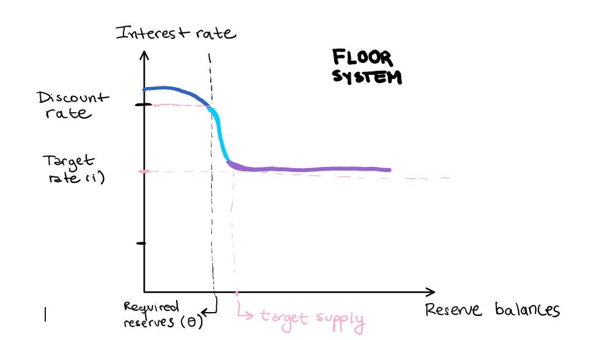

```{r setup, include=FALSE}
knitr::opts_chunk$set(echo = TRUE)
```

# Corridors and Floors in monetary policy

## Implementing monetary policy

Federal Open Market Committe (FOMC, from *FED*) has discussed strategies to normalizing the conduct of monetary policy. There is two *institutional frameworks* to implementing monetary policy, ie, the **money supply**: (1) corridor-type system and (2) floor type-system.

These frameworks use same tools but in a different way and procedures to influence conditions in money market. Principal tools are interest rates.

**A. Interest rates**

When we talk about interest rates, we can see to agents in the money market, that perceive in a different way the interests rates (**mark up**):

1. Lenders: who benefit from discount rates because they receive them when a creditor asks them for credit.
2.  Creditors: who benefit from the reserve rates, as they receive them when they deposit their money in the bank's reserves.

**Interest rates from the Central Bank perspective**
We frequently see this dynamic in the relationship that individuals establish with commercial banks. Now, there is a "bank of banks" that coordinates this relationship in the money market: the Central Bank.

**B. Steps to implement monetary policy**

*What is the procedure to achieve monetary policy implementation, i.e. to influence money market conditions?*

**Step 1**. The monetary authority choose a **target for the federal funds rate**, which is **average of market determined interest rate**[^tpm] at which **banks and certain other institutions lend funds to each other** (**interbank leading rate**) on an overnight basis. [^chile-bc]


[^chile-bc]: In Chile, at 9 AM.

**Step 2.**  Central Banks define two interest rates:

  1.  **Discount rate**: money that is *charged* to private banks if they want to ask to borrow money from the Central Bank.
  *Central Bank as lender*
  2.  **Interest-on-reserves**: money that the Central Bank *pays* to private banks for keeping their money in the reserve fund for one night.
  *Central Bank as a creditors*.


Figure 1. Interest rates in money market

**Step 3.** Demand and supply

#### Demand for Reserve Balances

Case A: *A normal day of a bank A, when reserve balances tend to zero.*

Let us imagine an extreme case where at the end of the day *Bank A* does not have enough money to pay its customers with liquid money. This *Bank A* will have two options: (1) ask the Central Bank or (2) ask Bank B, C or D.

What *Bank A* would have to pay to the Central Bank to receive this money is the **discount rate**. But *Bank B, C and D* will compete with that rate, offering a lower rate to *Bank A*. That is why the **discount rate** is said to be the *"ceiling "* of credit interest.

Figure 2 shows the demand curve of reserve. The main idea is the **inelastic** region when banks meet their reserve requirement because in this point reserve demand is **insensitive to changes un intereset rate**, and is more dertermined by *banks* resire to make payments (case B)


Figure 2. Demand curve reserve

Case B: *A normal day of a Bank B, when the reserve balances tend to infinity*

Now, let us imagine that a *Bank B* ends its day with a surplus in its reserve balances. This Bank B, in order to generate more money, could keep its money at the Central Bank (overnight, and that is why it is called overnight) to receive interest on that money. That is the **interest-on -reserves**.

Now, as in the previous case, *Bank B* could go to the money market and see that *Bank A* is willing to pay a higher rate than the one offered by the Central Bank to reserve that money. That is why it is said that the **interest-on -reserves** is the floor or *minimum rate* paid for the reserves or savings in monetary market.

Again, in Figure 2 we can see the demand curve flattens out into a **elastic region** where the demand is much more sensitive to changes in interest rates. Banks have sufficient balances (as Bank B) and there are **perfectly liquid**, with interest bearing. At least, Bank B could eran the interest reserve rate (only if deposited at the Central Bank).

### Supply of Reserve Balances

Central Bank objetives are:

1. **Financial stability**: aims to achieve through interest rates (1) and (2), which on average generate an interbank rate at which banks lend money to each other. It also works on the basis of reserve requirements (to avoid bank runs).

2. **Maintain inflation levels**: at the lowest possible level, achieved by interest rates and open market operations (buying securities to increase balances or selling securities to decrease balances). Lower discount rates will increase the circulating assets, which will make possible a higher consumption and demand for goods. Then, the prices of goods will rise and inflation will increase.

With **demand** and **supply** surve we can clearly see why Central Bank define upper and lower limits in interest rate to control money market.

**¡Atention!** Remember that the Central Bank does not have the possibility of controlling the demand for money, but rather what it does is to create instruments within the money supply to adjust this demand for money and in this way, be able to fulfill its main objectives as monetary authority.


### Summary: comparing different frameworks

|  | **Corridor system** | **Floor system** |
|---|---|---|
| Types of interest | 1. Discount rate <br> 2. Interest on reserves | 1. Interest on reserves |
| Role of discount rate | Defines the maximum amount that banks can earn from lending money | There is no concern about the ceiling because everyone is very willing to lend money. It's more importat floor |
| Role of interest-on-reserves | Because they are lower than the market interest rate, its role is limited to ensuring a minimum level of interest in making reservations (and the reserve requierement in order to law) | Banks can earn the market rate of interest on all their reserve balances |
| Target rate position | Often in the middle of interests rates | In the interest-on-reserves rate |
| Market characteristics | 1. Can use open market operation <br> 2. They have incentive to invest time to economize quantity of balances | 1. Banks with larger quantity of reserve are perfectly safe. <br> 2. Some literature indicates floor system's are used in recession context|
| |  | 


\pagebreak

# Friedman (1968) The rol of Monetary policy

Economic policy goals: high employment, stable prices and rapid growth. Instruments of economic policy are: fiscal policy and monetary policy. In economics is a wide discussion about the rol of both, but **monetary policy** shows a "apparently" more consensus about it limitated potential. Friedman discuss this ideas

Throughout the discipline, three perspectives on the role of monetary policy have been developed

## Monetary policy for price stability

- Monetary policy has no effect on the economy: Until the Great Depression, most economists believed that the new technologies of monetary policy were so important that they were able to control economic cycles. With the 1929 crisis, it was argued that monetary policy might not even affect inflation rates.

- Rol: promote price stability and to preserve the gold standard.
  - Chief criteria: the state of "speculation" and the movement of gold

## Monetary policy for inflation and unemployment regulation

- **Monetary policy with restricted effect**: Keynes, one of its main exponents, states that monetary operations involve simply substituting money for other assets without chainging total wealth (**distribution hypothesis**)
  - Liquidity preference is absolute, interest rates cannot be lowered by monetary measures
  -  Fiscal policy is a better aproximation (tax reductions, etc.)

-  *Keynesianism* indicates that monetary policy affect aggregates demand, but not the interest rate.
  -  In a world of flexible prices, a position of equilibrium at full employment might not exist. Unemployment had again to be explained by rigidities or **imperfections**, *not as the natural of a fully operative market process*.

- Monetary policy is an assistant to governemnt spending: helps to maintining high level of aggreate demand.

- Chief criteria of monetary policy: promotion of full employment, with the prevention of inflation (but secondary)

## Monetary policy for what it can control: inflation and stability of the banking and financial system.

This views are very similar. First don't take the importat role of this [^friedman1], and the second assigng to monetary policy a larger role than it can perform. Both are **danger** because they ask it to accomplish *task* and *contribution* that monetary policy cannot achieve.

[^friedman1]: Milton Friedman indicates Keynes subestimate the the aggresive monetary policy that take place during the Great Contraction (since 1929-1933), despite the contraction consequences. For example, they indicates "promotion of full employment" by prevention of inflation, but money market conditions seems to be secondary. Althought, there was a revival of the importance of monetary policy, and Friedman shows two main causes: 1. *Central Bank fails in its main objetive*: Federal Reserve System permitted a sharp reduction in monetary base ($H$), failing to provide liquidity to banking system. 2. *Desillusionment with fiscal policy*, with its potential to aggregate demand. Expenditures turned out to respond slow and with long lags to attempts to adjust them to the course of economic activity.


### Monetary policy cannot do

**1. Pegging of Interest rates** (*for more than very limited periods*)

- ***Misunderstood of the relation between money and interest rates***: during wartime and postware, FED keep interest rates down **buying securities**, and as a consequence it increase the **quantity of reserves** avaible to banks, hence the **amount of bank credit**, and, ultimately the **total quantity of money**. The main idea was to increase money to lower interest rates. But this process is **initial** :

  1. Throught the impact of rapid rate of monetary rate to **investment of lower interest rates *will stimulated spending***.
  2. One man's spending is an other man's income, and rising income will rise liquidity preference and demand for loans;
  3. Raising prices, which **would reduce the real quantity of money**.

- *Misunderstood **cyclical adjustment of interest rates***: is highly likely to raise interest rates temporarily beyond inicial level.

- ***Effect of individual price expectation on interest rates***: higher rate of monetary expansion will correspond to a higher *not lower*, level of interest rates than would otherwise have prevailed. It can occurs when people expect thst prices will continue to rise.  High and rising nominal interest have been associated with rapid growth in money (Chile, Brazil 1960)

- ***Temporal Significance on levels of interest rates***: low interest rates are sign that monetary *has been tight*, and high interest rates are sign monetary policy *has been easy*. An importan conclusion is interest rates are  misleading indicator of other monetary policy, that we need to consider widely to understand possible pradoxical cases.

**2. Pegging the rate of unemployment** (*for more than very limited periods*)

**Monetary authority cannot adopt a target for employment or unemployment**: despite when *monetary growth is widely held, will tend to stimulated employment*, the reason is the inmediate and delayed consequences of such policies are different than interest rates.

**1. Nominal and real rates**

**Difference in interest rates and employment**

  Interest rates: monetary authority can make the market rate less than the "natural" rate only by *inflation*. It is requiered when the rise of norminal rates need a more rapid inflation to hold down the market rate.

  **Employment rates**: there is some level of unemployment which has the property that is consistent with the equilibrium structure of real wages (**exogenous to the money market**). Real wages tend to a **average** at nominal or secular rate[^personal1].

  - A lower level of unemployment indicates a excess demand for labor, that will produce pressure to real wages rates. On other hand, higher levels of unemployment indicates excess of supply, that downward real wages (*Phillips Curve*).

  - "Natural" unemployment rate depends on structure of labor and commodity markets, including market imperfections, stochastic variabilities.

  - The factor determined by money supply is nominal wages, that must rise at the rate simply to keep real wages unchaged. But, **the demand and supply of labor is not the same of level of wages, rather is a consequence in a rise or downward in nominal wages.**

**Effect of monetary policy in employment**

- Monetary illusion: First, making nominal cash balances higher, stimulated spending. Here, still have the "natural" employment rate.
- Second, people expect prices to be stable and therefore increase their level of consumption. Firms react to the initial expansion in aggregate demand by increasing output, employees working longer hours and increase employment, *by taking jobs now ofered at former nominal wages*.
- Third, unemployment increase.  The fall *ex psot* in real wages to employers and the rise *ex ante* in real wages to employees is what enable employment to increase. Selling prices of products typically respond to an unanticipaed rise in **norminal demand faster than prices of factors of production**, real wages received have gone down.

**Temporary trade-off**

Is there a **temporary-trade off** between inflation and unemployment ("rising"); there is no "permanent trade-off" ("high").
- In interest rate we can use controls to peg nominal quantitys (nominal by nominal), such exchange rates, price levels, national incomes, quantity of money.
- In employment we cannot use nominal control. It's no possible to peg real quantities by nominal  quantities, we don't know de "change of the trade-off".

[^personal1]: We talk about wage distribution, no "level of wage"

### What monetary policy can do

Despite cannot peg real magnitudes, there is an important **effect over these magnitudes**. To growth economy, as money es *ominipresent*, monetary policy can **adjust** $\Longrightarrow$ "avoid major mistakes", ie, prevent money being a *major source* of economic *disturbance*. Monetary authority can solve problems even when there hasn't been intervetion by monetary policy.

**Monetary authority tasks**

**1. Stability in financial and bank system:**
 - Suggest improvement in monetary tools that will reduce chances that it will get out of order
 - Use own powers to keep supply money working

**2. Provide trust and certain**
  - Stable background for the economy, in flow balace of payments (reserves and inflation)
  - Certain to consumers, employers and employees ("know the future") keep in health economy

**3. Contribute to offsetting major**
    - Disturbances in economic system (postwar, COVID, etc) can contains with money supply. But the first task to monetary authority is **protect inflationary***. This can helps goverment, deficit in balance of payment flows *without sterilizing*.
    - Also, monetary policy in offsetting other (non-economic) forces is **limited**
    - Central Banks can do policy when they offer a *clear* and *present* danger to the economy.

**Problems**

  **Unflexible normatives**
  - In prices and wages, thus cannot adjust to dinamic changes and technology.
  - Normative rules can change absolute levels of prices but are not economic tools

  **Relationship with goverment**
  - Central Banks will be impersonal and delibertaed, to do automatic process when is needed.


### Conducted monetary policy

There is two major requirements

1. Tools and magnitud can **control**
  - Control: exchanges rates, price level by index, qunatity of monetary total (deposits, commercual banks reserve)
  - No control: interest rates and unemployment
2. Avoid sharp swings in policy
  - "Too late" and "too much". The reason for propensity to overreact is *decision by today conditions* have a **lag** of *effect*.
  - Remember Central Bank task is give us **trust** in economy by **certain**: is more important a **kwown rate** or **fixed rate** that would on the average produce moderate inflation.
  - Give *truth springs of economic growth* (enterprise, ingenuity, invention) a favorable climate to effective operations.

## Summary

|  |  |  |  |
|---|---|---|---|
| Main idea of monetary policy | Monetary policy has no effect on the economy, might not even affect inflation rates. | Monetary policy affect aggregates demand, but not the interest rate because it's only involve simply substituting money operations.  | Monetary policy has effects on the real economy but can only adjust monetary demand with instruments specific to its system. |
| Rol | Promote price stability and to preserve the gold standard. | As an assistant to goverment spending in mantaining high level of aggregate demand | Provide trust, certain and stability to financial and bank system |
| Chief criteria | The state of "speculation" and the movement of gold | 1. Promotion of full employment, <br> 2. with the prevention of inflation (*but secundary*) | 1. Avoid sharp swings <br> 2. Operations with tools and magnitudes can control  |
| Social context where it was developed | Great Depression | Postcrisis 1929 | Postwar |
| Principal exponents |  | J. M Keynes | M. Friedman |

## Introduction about Federal Reserve (FED)

1. Regulate and oversee the nations commercial banks by making sure that banks have enough money to avoid bank runs

2. Conduct **monetary policiy** which is increasing or deacresing the money supply to speed up or slowd down the overall economy.

*in spanish*

Recordemos que la política fiscal cambia gasto publico e impuestos, mientras que la política monetaria la **oferta de dinero**.

- Tasas de interés: es el monto al cuál se presta dinero. Cuando los bancos prestan dinero espera que se pague el monto que se prestó, llamado capital.

Cuando las tasas de interés son bajas, se facilitará a los prestatarios el reembolso de los prestamos, por lo que ellos podrán  pedir más dinero y gastar más dinero.

Cuando las tasas de interés son altas, los prestatarios tienen menos dinero y gastarán menos dinero.

En muchos países, y en general, los Bancos Centrales **no tienen el poder de fijar la tasa a la cuál los bancos comerciales fijan las tasas de interés**, solo pueden hacer esto **cambiando la oferta monetaria**:

- Si el Banco Central aumenta la oferta monetaria, los bancos privados tendrán más dinero que prestar.

*Veamos la siguiente situación:*
- Los individuos (prestatarios) buscarán la mejor oferta para buscar un préstamo. Luego, los bancos se verán obligados a bajar las tasas de interés pues tendrán que competir o de lo contrario nadie les pedirá prestado.
- Una disminución de la oferta monetaria afecta negativamente pues los bancos tendrán menos dinero que prestar, y por tanto la tasa de interés será más alta pues será más caro prestar (o más difícil).

1. Política expansiva: para acelerar la economía, se debe aumentar la oferta monetaria pues esto reducirá las tasas de interés y con esto se conducirá a más prestamos y gastos.

2. Política contractiva: para frenar la economía, se reduce la oferta monetaria, y menos dinero disponible hará que las tasas de interés aumenten y disminuya el gasto

Algunos ejemplos de situaciones y tipo de política implementada.

1. Recesión o brecha de estancamiento: producción era baja, desempleo alto. Al aumentar la oferta de dinero, se facilitó el endeudamiento y aumentó el gasto. Como resultado la economía comenzó a crecer nuevemente.

2. En los 70s los precios subían un 13% al año, produciéndose una inflación del 3 a 4%. El FED redujo la oferta monetaria, y con eso las tasas de interés subieron mucho. Pero la gente compró menos casas y autos, y cayó la inversión empresarial. La política monetaria redujo la inflación pero resultó en una tasa de desempleo.

3. Gran depresión: el año 1973  Bernanke mismo indica que lo hicieron mal dado que no cumplieron dos condiciones relevantes para la sanidad del sistema financiero:

1. Confianza: Cuando los clientes depositan dinero en un banco deben estar seguros que recuperarán su dinero. Durante la gran Depresión varios bancos se vieron en quiebra (cerca de 1/3)

2. Liquidez: los bancos quiebrn pues no tienen activos liquidos (liquid assets). Tenían acciones, bonos e hipotécas pero no dinero. Entonces, cuando los depositantes entraron en pánico, los bancos no tenían dinero.

La culpa ha sido del FED pues no dio prestamos de emergencia a los bancos, lo que hubiese aumentado liquidez de bancos y hubiese aumentado la oferta de dinero.


**Formas de cambiar la política monetaria**

Cuando ponemos dinero en el banco, el banco se queda con una parte en depositos (reserva fraccionaria = encaje y depositos) y presta el resto ($C$)

1. Encaje o *reserve requierement*: reducir el requisito de reserva aumenta la oferta monetaria.

2. Tasa de descuento: Como el banco central es el banco de los bancos, estos pueden pedirle dinero al Banco Central cuando quieren hacer más prestamos.

Reducir la tasa de descuento facilita pedir prestamos a los bancos, y de esta forma la oferta monetaria aumentará.

3. Operaciones de mercado abierto: esto es cuando el FED compra o vende bonos del fisco a corto plazo ("el gobeierno devoverá más adelante"). Esto se hace pues es menos riesgoso que acciones.

  1. Compra de bonos: con esta operación se aumenta la liquidez y con eso la oferta monetaria a ese banco.
  2. Vende o emite bonos: el banco tendrá menos efectivo y menos dinero que prestar, y con eso reducirá oferta monetaria.

Quién define esto es el Comité de Mercado abierto (FOMC)

**Decisiones de la política monetaria**
Con estas estrategias los Bancos Centrales pueden **aumentar o reducir la oferta monetaria *muy rápidamente***

Durante la crisis financiera de 2008 cuando la economía estaba en una profunda recesión, el FED compró muchos bonos. Con esto las tasas de interés bajaron prácticamente a cero. Pero esto no fue suficiente: la economía estaba en una situación mala. Entonces el FED hizo algo muy fuera de norma a los bancos centrales. Aumentó el estimulo monetario con algo llamado **flexibilización cuantitativa** (quantitative easing Q.E). Esto es que el banco central compro activos a largo plazo a los bancos, como si fueran hipotecas.

La compra fue con "dinero falso" pues esta relajación cuantitativa generó hiperinflación, pues cuando se agrega mucho dinero falso a la economía **los precios pueden subir**. Miltron Friedman dijo "La inflación siempre y en todas partes, un fenómeno monetario"

- Se dejó guardado más de las reservas, pues las leyes de prestamos eran muy alto.
- Baja inflación en USA se debe a la reserva de dólares en Europa
