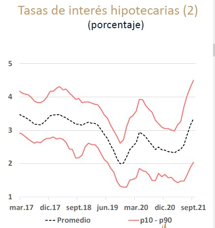
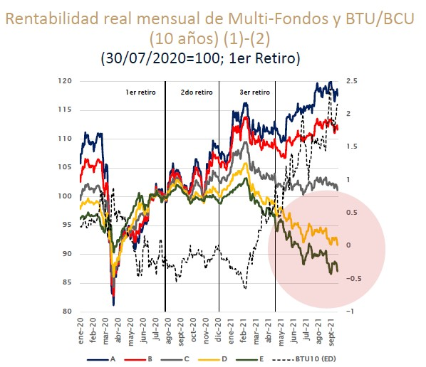
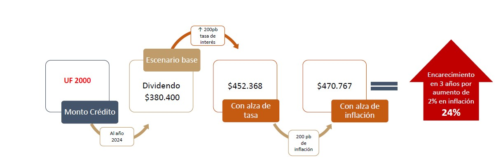
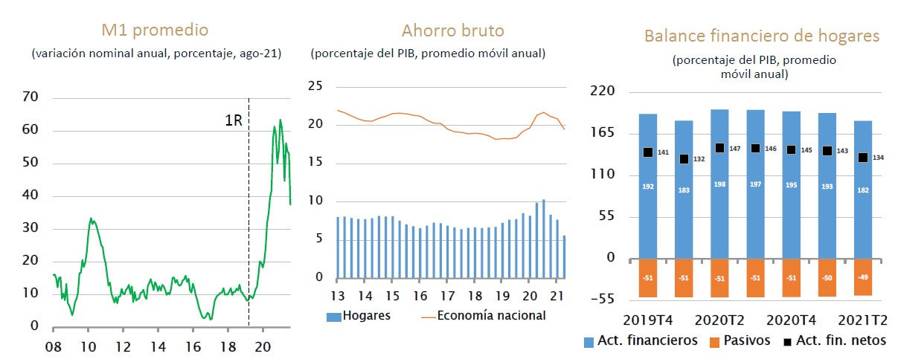
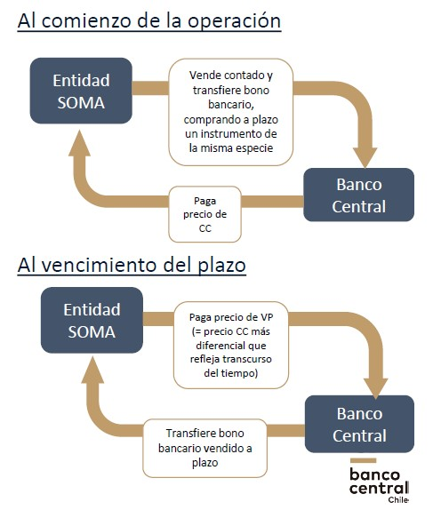

```{r setup, include=FALSE}
knitr::opts_chunk$set(echo = TRUE)
```

# Risk to Central-Bank independence (Kenneth Rogoff)

Los bancos centrales enfrentan desafíos en lograr tomar medidas efectivas para cumplir sus objetivos, en particular, reducir o estabilizar la inflación ($\pi$).

Frente a los problemas, ha quedado poco espacio para hacer política monetaria. La pérdida de efectividad se da por ejemplo, cuando ya no se pueden acotar más las tasas de interés dado que ya son muy bajas u ocupar comunicación de políticas en contexto de desconfianza.

> *[If high inflation is followed], it may be even harder to put the inflation genie back in the bottle* (p.50)

## Roles del banco central

**Task 1**: Inflación baja y estable

**Task 2**: Estabilización macroeconómica: suavizar los efectos del ciclo económico

**Task 3**: lidiar con las crisis financieras

**Task 4**: lidiar con la deuda del gobierno

Notar que no solo inflación, sino que otras cosas pues estas podrían despues tener efecto en inflación.

## III. Dealing with financial crisis

El Banco Central tiene una serie de ventajas a corto plazo sobre los Ministerios de Hacienda, ante emergencias

+---+-----------------------------------------------------------+-------------------------------------+
|   | Central Bank                                              | Government                          |
+===+===========================================================+=====================================+
|   | Quickly                                                   | Need legislation                    |
+---+-----------------------------------------------------------+-------------------------------------+
|   | Decisvely (Autonomy)                                      | Depend of politics                  |
+---+-----------------------------------------------------------+-------------------------------------+
|   | Acertive (Knowledge and experience with financial system) | No necessarilyexperience in finance |
+---+-----------------------------------------------------------+-------------------------------------+

-   Pese a la experiencia y rol durante el 2008, **es peligroso** cuando la política **quasi-fiscal** se vuelve una **rutina** pues se puede transformar un **problema** para preservar la **independencia**.

    -   Se dice que durante el 2008 podría haber jugado un mejor rol para **evitar corridas bancarias** (importancia en mantener la estabilidad del sistema financiero)
    -   Posiciones políticas buscarán mover el gasto del gobierno (aumentar o disminuir), lo que tiene efectos a corto plazo sobre la demanda agregada[^1]

-   Eso **no** implica que Banco Central tenga rol en lo **fiscal** (impuestos y redistribución)

    -   Puede tomar la forma de financiamiento de la deuda del gasto del gobierno y cortando tasas de interés, como también políticas redistributivas sobre sectores con menores ingresos que tienen una *alta propensión marginal a consumir*
    -   En consecuencia, la política fiscal es principalmente **contenciosa y política**.

[^1]: economía a escala humana, tal como decía Marcel, dado que este cambio (aumento o disminución) produce un cambio en ingresos netos, disponibles.

<!-- -->

-   Pese a esta capacidad hay que tener cuidado con

1.  Redistribución: no tiene el poder de redistribuir el ingreso entre los ciudadanos. **La mejor opción sería un Helicopter Money si es que se necesita liquidez**
2.  Destruir deuda (tears up debt): algunos plantean que compre deuda y la destruya, lo cual solo tiene efectos negativos

-   **Analogía de la deuda familiar**: No tiene un efecto real en el endeudamiento pues la deuda que tiene el gobierno es con privados, entonces **alguien tendrá que pagar esta deuda**. $\rightarrow$ **no efecto en la deuda**

-   **Credibilidad**: cuando se financia mucho la deuda y se repite, la independencia puede desaparecer. A no ser que recupere credibilidad, la inflación objetivo es dificil que se logre pues su efecto en términos de expectativas será cero.

-   **Confianza de reservas**

2.  **Inflación incontrolada a futuro**: las **expectativas de la inflación subirán** pues se piensa que puede ser una forma frecuente de imprimir dinero (una forma frecuente de política monetaria) **"sin consecuencias"**.

3.  **Reduce el valor real de la deuda privada**: el no poder aumentar la inflación durante las crisis es un problema pues la inflación no esperada produce que se reduzca el valor real de la deuda privada, y por lo tanto, se ve obligado a pagar los costos de esa deuda.

Como resultado hay menos instrumentos para enfrentar a la deflación durante las crisis financieras, mucho más que "creando inflación". ¿Qué pasa con tasas de interés cercanas a cero o negativas? (\$i (-) = r + \pi (-) \$)

## IV. Dealing with government debt

-   Hay una percepción de que

    1.  Ya no se necesita enfrentar la inflación, dado que durante un largo periodo la inflación ha sido baja (debatible)
    2.  El aumento de la inflación esperada no será un problema a pesar de que suba la deuda (dudoso)

1.  La deuda está completamente vencida (Blanchard, 2019): la economía es un equilibrio ineficiente donde, sea cuales fueran las razones, la **tasa de interés nominal está bajo el crecimiento de la economía**.

-   El segundo punto podría ser verdad si los nuevos fondos del gobierno son gastados en retornos de capital humano y físico. En ese caso la deuda no produce grandes presiones inflacionarias

-   El punto más debatible es que hay un equilibrio *frágil* donde la deuda es más rápida, independiente del nivel de deuda. Pero para los inversores los países con gran deuda son una preocupación.

2.  Acumular deuda - MMT

-   *MMT* plantea que se puede acumular deuda a largo plazo y a un costo bajo en la medida en que el Banco Central utilice instrumentos como el *QE*, utilizando las reservas de los bancos para poder comprar deuda del gobierno a largo plazo.

-   Si las reservas de los bancos pagan interes, luego el efecto de primer orden planteado por MMT será seriamente ajustado o recortado de la estructura de deuda vencida del gobierno.

-   Si las reservas *no pagan interés*, en la medida en que las tasas de interés van en aumento, los bancos tendrán que luchar con una inflación muy alta.

-   Para MMT Desde el punto de vista de las hojas de balances del gobierno, el Banco Central solo juega un rol menor

-   **Sesgo del presente**: Si hemos aprendido algo del pasado, los shocks y sus efectos no son predecibles (son distintos unos de otros). Unas veces necesitaremos financiar la demanda de gasto del gobierno y otras veces no. Lo importante es asegurar la ruta para que las tasas de interés funcionen como se espera a mediano y largo plazo.

    -   La política monetaria no es constante, sino que contingente.
    -   Busca trazar rutas o vías.

-   **Independencia:** las decisiones sobre la estructura de endeudamiento del gobierno, no son evitables por el Banco Central. Su rol, más bien, está puesto en controlar la hiperinflación.

    -   *Prioridades de BC*: Banco Central encargado de controlar las tasas de interés de reservas (y concentrado en ese ejercicio), las medidas QE se vuelven innecesarias e irrelevantes. Pero si no es así, y están puestos sus ojos en la deuda del gobierno *antes que de la inflación*, es probable que se produzca un contexto inflacionario.

## Problemas

### 1. Zero lower bound on interest rates

-   *1°* $\triangle$ de los bancos centrales modernos: Tendencia global de caída de la tasa de interés real que se agudizó notablemente tras la crisis financiera

    -   Limita la efectividad de la política monetaria para estabilizar

### 2. Independencia

*4°* $\triangle$ de los bancos centrales modernos: deuda de gobierno y política monetaria

-   "Efecto cadena": si los gobiernos cortan la habilidad de los bancos centrales de definir las tasas de interés para estabilizar la inflación y el crecimiento, la **credibilidad anti-inflacionaria** se pone en riesgo, y así, se pierde la capacidad de los gobiernos de volver a poder controlar la inflación (poner el genio en la botella).

    -   Una vez que está a rienda suelta la inflación es más dificil controlarla por (1) expectativas, (2) poca capacidad de respuesta, (3) no hay margen de acción (y menos si no hay independencia, pues no se pueden aplicar medidas agresivas)

-   Importancia de la efectividad: Es meramente superficial si no tiene un efecto real la política monetaria (pérdida de 4 y cambio de 3)

*Posiciones respecto a política monetaria*:

-   Izquierda: Financiar aumento de la deuda del gobierno y expandir sus hojas de balances

-   Derecha: Reducir las tasas de interés y reducir hojas de balances

### Monetary and fiscal policy

-   \*\*Independencia y estabilización macroeconómica\_(tarea 2)\_\*\*: como es independiente puede hacer cambios más rápidos y drásticos (como bajar las tasas de interés en recesión).

-   Ahora bien, ha existido una **confusión conceptual entre la política monteria y fiscal** atribuyendole más capacidades y objetivos del que tiene.

-   En el corto plazo, al intentar salir de la *trampa de la liquidez*, se aplicarán **instrumentos alternativos de política monetaria** o **quasi fiscales** tales como *QE* y *forward guidance*.

    -   El Banco Central se ve como un "junior" del ministerio de Hacienda

### 3. Expectativas

-   Sobre roles o responsabilidades, donde muchas veces se espera o atribuye más de lo que es capaz: desde regulación financiera hasta política quasi-fiscal[^2] para mitigar la desigualdad social.

-   *1°* $\triangle$ de los bancos centrales modernos: La inflación alta parecer ser un problema distante al siglo XXI[^3], lo que trae un problema para estabilizar la inflación.

    -   **Expectativas e independencia**: la inflación ha sido baja tanto tiempo que la gente se olvida de los altos niveles de inflación antes de la independencia de los bancos centrales (p.31). Se piensa que es algo "por default" o que *"este tiempo es diferente"*[^4]

[^2]: "people's quantitative easing" to provide central-bank financinf for government investment initiatives.

[^3]: *"Víctimas de su propio éxito"*

[^4]: no confiando en las leyes o desarrollo de la teoría y evidencia sobre la política monetaria.

### 4. Credibilidad

*3°* $\triangle$ de los bancos centrales modernos: credibilidad sobre su capacidad

-   Expectativas de una inflación del 2% o bajo eso son prueba de que la credibilidad del banco central se fortaleció. Ahora bie el problema es que eso no considera que, en el caso de un *shock* (pandemia o conflictos sociopolíticos), una inflación moderada puede ser una solución importante [^5]

-   Credibilidad guarda relación con **independencia**: si se da paso a formas *quasi-fiscales* que no solo no son efectivas, sino que se pone en tensión la noción de "autonomía" pues se ve que ministros de hacienda tienen mucha relación con bancos centrales.

    -   Una vez que se ve que el equilibrio puede ser roto, volver a confiar en que la política monetaria es efectiva se vuelve difícil.

-   Anti-inflation credibility: se logra cuando el público espera que el Banco Central le otorga más importancia a la estabilización inflacionaria que todo el resto de la sociedad.

-   **Trade off entre credibilidad (compromiso) y flexibilidad**[^6]: en un periodo dado el Banco Central puede aplicar todas las medidas para controlar la inflación, pero al mismo tiempo, la ciudadanía puede pensar que se puede abusar en el futuro de ese privilegio ($\triangle$ de expectativas), lo que puede implicar un aumento en las tasas de interés e inflación.

    -   Si se aplica política **cambiante** (*con "espacio para la discreción"*) , y se pierde *credibilidad* sobre manejo de la PM, las personas creerán que $\uparrow \pi$
    -   Si se aplica política *inflexible* (fixed-money-supply-growth by Friedman rule) no se tendrá en cuenta cambios en sistemas de pago que pueden producir que la demanda de base monetaria se vuelva muy inestable.
    -   **Solución**: **clausulas de escape**[^7] con reglas previamente definidas, pero que consideren la inflación deseada como un **parámetro dinámico**, con cambios en su medición y tasas de cambio[^8].

[^5]: recordar lo que dice De Gregorio en su libro respecto a la importancia de una inflación positiva.

[^6]: no hay trade off entre flexibilidad y compromiso (Taylor, 1993)

[^7]: Central bank's failure to quickly activate an escape clause during the 2008 financial crisis helped to depth and duration recession.

[^8]: igual abre puerta a la $\pi$ oportunista (Kydland and Prescott (1977); Barro and Gordon (1983))

## Alternative monetary instruments

-   Provienen de la Modern Monetary Theory (MMT)

-   Débilmente eficaces en estimular el output y hacer cambios en la inflación, a diferencia de la política monetaria de tipos de interés

-   **Credibilidad**: Su emergencia y uso produce una $\downarrow$ en credibilidad y objeto **anti-inflacionario**

-   **Quasi -fiscal**: ponen en tensión **independencia** del Banco Central

-   Lower bound and QE and limited effect "paralysis" PM (lo mejor tener margen +- 500)

#### *Quantitative Easing (QE)*

Objetivo: financiar gasto público a partir de la compra de bonos a largo plazo con tasas overnight de reservas (lower bound - muy baja), lo que es igual al valor a corto plazo de la tasa de interés de la moneda ($i=0$).

-   Mecanismo: tasa nominal fuera cero, se va a sustituir bonos por dinero. Entonces ante esa "trampa de liquidez" pues a corto plazo ya no puedo seguir bajando la tasa de interés a corto plazo (*política monetaria de tasas de interés*). Pero, **sí puedo cambiar la tasa de interés a largo plazo** pues ya no puedo cambiar la actual. Entonces el Banco Central compra deuda a una menor tasa de interés a largo plazo, lo que beneficia al agente (privados o gobierno) pues obtienen liquidez a bajas tasas de interés.

-   Cuando son masivos los préstamos por *QE*, también hacen caer en la trampa de la liquidez. Por ello es un error pensar en que se debe aplicar en contexto de *trampa de liquidez*

-   Por consiguiente **no implican imprimir dinero**, más bien es una acomodación sobre el vencimiento de la deuda del gobierno ($\triangle$ y cuadrar hojas de balance de gobierno).

-   Es refinanciar los riesgos del gobierno (es muy *ad hoc* al gobierno). en el fondo al prestar a tasas de interés tan bajas a largo plazo el Banco Central se está haciendo cargo de deuda del gobierno "vencida"- madurada parte de su estructura de endeudamiento. Por consiguiente, el *Banco Central* con estas medidas no está poniendo por delante controlar la *inflación* y la *producción* a corto plazo pues:

    1.  Si demanda por dinero sube ($\uparrow M^d$) a largo plazo la inflación ($\uparrow \pi$). Lo que trae problemas en el corto plazo pues aumentará masa monetaria ($\triangle M$), junto con que no se sabe respecto a qué hacer cuando $i \approx 0$ hace hacer más difícil control inflacionario por la trampa de liquidez.

    2.  Pone en riesgo hojas del balance del *Banco Central* que es un componente importante en la **credibilidad**, además de tener un componente "fiscal" pues **subsidia el gasto del gobierno**.

    3.  Existe la posibilidad de que esa necesidad de refinanciar se repita, por lo que este riesgo se aumenta

Noción de familia:

**Efectos**

-   Efectos sobre las hojas de balances de los gobiernos (pensar en contexto COVID-19)

-   Efectos de segundo orden sobre inflación y producción: comparando con la política de tasa de interés, su efecto sobre $\pi\land Y$ es secundario

-   A largo plazo, puede generar **alta inflación**.

-   A corto plazo, reduce *i* para *"reactivar economía"*

-   Estos efectos tan distintos han creado una **confusión** sobre los **potenciales efectos inflacionarios que tiene QE**

-   Pone en tensión la credibilidad sobre el objetivo **anti-inflacionario del Banco Central** y su **independencia**.

#### *Fiscal Quantitative Easing (FQE)*

-   FQE: Ministerio de Hacienda compra deuda de los privados, y luego Banco Central compra esa deuda (riesgo directo e indirecto)

-   QE: Banco Central compra la deuda del gobierno (riesgo directo)

Si el Banco Central compra deuda privada en vez de la deuda del gobierno, los efectos son mayores, dado que esto implica subsidiar a un sector privado específico y creando responsabilidad desde el Banco Central sobre estos sectores.

#### *Foward Guidance*

------------------------------------------------------------------------

Un caso especial es la situación del FCE en la Eurozona donde el Banco Central Europeo (ECB)

Recordemos que en lugares con un i alto, la FQE hace que aumente la "impresión de dinero", por lo que $\pi$ aumenta (lo que lubrica la economía según De Gregorio cuando hay contextos de deflación). Y en el caso de países con i bajo, ayudará a financiar la deuda doméstica.

-   Los bonos en Europa se venderán al mismo precio (Eurobond) a todos. Entonces a algunos países les implicará una tasa de interés más alta que la doméstica, mientras que a otros una más baja.

-   ¿Relación deuda externa e interna?

------------------------------------------------------------------------

## Negative interés rate [^9]

[^9]: victims of their own dogmatism with "inflation-targeting", has leeft too little flexibility for dealing with outside-the-box events.

-   ¿Qué se puede hacer para que la política monetaria vuelva a ser relevante en un contexto de caída de las tasas de interés a nivel mundial?

    -   Solución simple: pasar todo el dinero a digital, pero no es posible por la inclusión financiera y digital. También pone en tensión principios de privacidad.

**Política de Tasas de interés negativas**

Mecanismo: si se tienen notas grandes se pueden tener o "depositadas" (Banco) o "en casa" (Circulante). Hay que crear un estimulo para que estas sean depositadas aun cuando estamos ante "trampa de liquidez" (*bancarización* en contexto de *sustitución de depósitos por dinero*)

La solución de las **tasas de interés negativas** tiene una dimensión **monetaria** e **institucional que** tienen efectos en

-   *Controlar inflación*
-   *Credibilidad del Banco Central*
-   *Reduce evasión y mercado negro* (grande)

1.  **Monetariamente**

-   Hace transacciones más fáciles (reduce costos de operación).

-   Eliminar billetes grandes y quitar ceros: agrega control fiscal a grandes masas ante redepositos de circulante

2.  **Institucional**: aplicar legislación para que sea más seguro guardar dinero en bancos que mantener como circulante. **Protección a depositantes**

-   Este tipo de política ocupar fricciones y barreras del Estado para hacer efectiva la *independencia*.

-   Reconocer el cambio del contexto financiero y cambiario que permite eliminar la "lower bound" de las tasas de interés.

-   Alternativamente crear un interés específico asociado a electrónico y circulante: durante periodos donde el banco central fija una tasa de interés negativa (que también aplica a sus propias reservas), el banco central no tendrá que aceptar el paper billete como medio de intercambio como **sustituto** del dinero electrónico. De hecho **eso es algo que ya pasa** donde **dinero físico y electrónico no son sustitutos perfectos** pues entregan intereses diferentes

    -   En ese contexto, si i es negativo demando menos dinero por su interés asociado, dado que el electrónico me significa otro tipo de intereses. Además, el costo fijo (Z pensando en modelo BT) con dinero electrónico disminuye o tiende a cero por las *facilidades que significa*.

### Desarrollo de implicancias

-   Puede ser importante durante las recesiones para estabilizar las hojas de balance: aumentar el ahorro, con eso aumentar luego la inversión y luego el output.

-   Así se podrá jugar con la tasa de interés negativa o cero, teniendo implicancias de manera efectiva a **corto plazo**.

    -   Por lo tanto, el control inflacionario implicaría un cambio de la política monetaria de tipo de interés. La caída en los billetes (o haciéndolos casi desaparecer) + medidas administrativas. En la medida en que el billete físico se vuelve marginal como un medio de intermcabio legal, más interés o incentivo estará en depositar, lo que promoverá mayor *inclusión financiera* y **cumplimiento del pago de los impuestos**.

#### Consecuencias de i negativo

**¿Por qué no son injustas las tasas de interés negativas**

1.  Con la tecnología moderna, las transacciones no son dificiles para depositantes pequeños. Si bien hay un grupo afectado es marginal
2.  Para quienes ahorran en distintos portafolios, la tasa de interés negativa subirá a largo plazo el precio de los **bienes durables** (por lo que los premiará)
3.  En el largo plazo, la tasa de interés volverá a subir, en la medida en que la tasa de interés negativa es efectiva., y con ello podrá afectar contextos de deflación y aumentar crecimiento.
4.  Como consecuencia de lo anterior, puede ayudar a recuperar el empleo y el ingreso en contextos deflacionarios o de crisis.

**Otras consecuencias positivas**

5.  Permitirá recuperar **credibilidad al banco central** por su efectividad en política monetaria.
6.  Restaura los balances entre la política monetaria y fiscal, en la medida en que sería mucho más rápida en responder en contextos de crisis, y está menos politizada que la política fiscal.

## 1. Four challenges for modern central banks

1.  Communication: memory and financial education

2.  Limited effectivines

3.  Importance of PM in crisis

4.  Debt and PM

# Nuevo retiro de pensiones

## Canales de impacto económico

**1. Canal financiero**: impacto sobre precios financieros de liquidar activos equivalentes a 6-7% del PIB en plazos breves, mayor volatilidad y menor liquidez

**2. Canal macro de corto plazo**: impacto sobre consumo, demanda y actividad condicionado por distribución de retiros, propensión a consumir/ahorrar y componente importado del consumo

**3. Canal estructural**: impacto sobre tasa de ahorro, profundidad del mercado de capitales, y necesidades financiamiento externo

**4. Canal expectativas**: efecto sobre incertidumbre y aversión al riesgo asociado a repeticiones de medida; cambio de percepciones de riesgo para la economía chilena por debilitamiento amortiguadores, agotamiento de holguras

### Impactos en el mercado de capitales local

#### 1. Tasa interés aumentan en todos los plazos y tipo de créditos

-   La tasa de interés aumentan a todos los plazos. Esto se traslada a tasas de todos los tipos de crédito (condición de no arbitraje)

-   Diferencias con tasas de interés de otros países aumenta (factores idiosincráticos)

-   Cambio estructural al disminuir el **ahorro a largo plazo**

#### 2. El peso chileno pierde valor frente a otras monedas

*tasa de interés y tipo de cambio* (p.18)

-   Pese a ingreso de divisas internacionales, moneda pierde valor frente a monedas internacionales. En tanto, las tasas de interés incrementan por deterioro de mercado de capitales doméstico

-   La liquidez del mercado se reduce

#### 3. Volatilidad y preferencia por moneda extranjera

-   Liquidaciones masivas, mayor incertidumbre y menor poder de mitigación de fondos de pensiones se asocian a un incremento de la *volatilidad de tasas de interés y tipo de cambio*

-   *Dollarization* de hogares y empresas no financieras

    -   Sustitución de moneda nacional internamente como circulante y depósitos

    -   Aumento de depósitos e inversión en exterior

#### 4. Aumento de costo de financiamiento fiscal

-   El aumento de las tasas implica un aumento en el pago de intereses por parte del Gobierno

-   Esto excede la recaudación de las medidas tributarias propuestas (equivale al presupuesto anual 2022 para la gratuidad de ESUP)

#### 5. Aumento del crédito hipotecario

-   Deterioro de condiciones financieras afecta a las tasas de interés hipotecarias

{width="200"}

#### 6. Rentabilidad fondos de pensiones

-   Alza de tasas este año ha provocado una ***rentabilidad negativa de los fondos*** con mayor exposición a renta fija.

-   Por la misma razón se han visto cambios significativos de afiliados desde fondo E a otros

{width="278"}

#### 7. Salida de capitales

-   Se ha registrado una salida de capitales de empresas y hogares

-   Incipiente preferencia por activo en dolares

## Proyecto no es una mera repetición

Efectos de proyectos anteriores son acumulativos y van evolucionando dejando en una nueva situación base en términos económicos

1.  Involucran mayores exigencias para sistema previsional
2.  Mercado de capitales más debilitado y expuesto: caerá la inversión (\$I\$, y se puede ver por curva IS), tasas de interés suben y dividendos también
3.  Tiene mayor costo fiscal: aumento del gasto fiscal (\$G\$)
4.  Beneficia proporcionalmente más personas menos afectadas: y las personas con más ingreso no necesariamente se va a consumo
5.  Contexto sanitario y económico distinto: sin lockdown y se vuelve a *demand driven*. Por curva LM podemos ver que entonces \$\\uparrow Y \\uparrow i\$


+----------------------------------+----------------------------------------------------------------------------------------------------------------------------------------+-------------------------------------------------------------------------------------------------------------------------------------------------------------------------------------------------------------------------------------------------------------------------------------------------------+
| Concepto                         | Argumento                                                                                                                              | Impacto                                                                                                                                                                                                                                                                                               |
+==================================+========================================================================================================================================+=======================================================================================================================================================================================================================================================================================================+
| Excepcionalidad de medida        | No puede evaluarse como fenómeno aislado, sino que repetitivo y **acumulativo**                                                        | -   Canal de expectativas: sucesión de medidas prácticamente idénticas, sin tomas en cuenta los cambios en el escenario macroeconómico, fiscal y social                                                                                                                                               |
+----------------------------------+----------------------------------------------------------------------------------------------------------------------------------------+-------------------------------------------------------------------------------------------------------------------------------------------------------------------------------------------------------------------------------------------------------------------------------------------------------+
| Impacto sobre mercado financiero | -   Tasa de interés                                                                                                                    | -   **Canal financiero y expectativas**: alza de tipo de cambio y tasas de interés de mercado, en particular la de créditos hipotecarios                                                                                                                                                              |
|                                  |                                                                                                                                        |                                                                                                                                                                                                                                                                                                       |
|                                  | -   Financiamiento de largo plazo                                                                                                      | -   **Canal macro a corto plazo**: aumento de la inflación                                                                                                                                                                                                                                            |
|                                  |                                                                                                                                        |                                                                                                                                                                                                                                                                                                       |
|                                  |                                                                                                                                        | -   **Canal estructural**: impacto en tasa de ahorro, profundidad de mercado de capitales, acceso a financiamiento externo y costo de financiamiento                                                                                                                                                  |
+----------------------------------+----------------------------------------------------------------------------------------------------------------------------------------+-------------------------------------------------------------------------------------------------------------------------------------------------------------------------------------------------------------------------------------------------------------------------------------------------------+
| Demanda interna                  | -   Acumulación de liquidez puede generar aumento abrupto de demanda interna                                                           |                                                                                                                                                                                                                                                                                                       |
+----------------------------------+----------------------------------------------------------------------------------------------------------------------------------------+-------------------------------------------------------------------------------------------------------------------------------------------------------------------------------------------------------------------------------------------------------------------------------------------------------+
| Implicancias distributivas       | -   Beneficios decrecientes para personas con menores ingresos y costos cada vez mayores con plazos cada vez más breves de liquidación |                                                                                                                                                                                                                                                                                                       |
+----------------------------------+----------------------------------------------------------------------------------------------------------------------------------------+-------------------------------------------------------------------------------------------------------------------------------------------------------------------------------------------------------------------------------------------------------------------------------------------------------+
| Espacio de acción de BCCh        | -   BBCh continuará aplicando sus facultades para amortiguar el impacto de estas medidas                                               | -   **Canal estructural**: *efectividad* de las medidas destinadas a amortiguar el impacto de los retiros sobre los mercados financieros se ha ido reduciendo[\^ipom-oct](En%20el%20último%20IPOM%20el%20Banco%20Central%20declaró%20que%20su%20capacidad%20de%20amortiguar%20inflación%20es%20menor) |
|                                  |                                                                                                                                        |                                                                                                                                                                                                                                                                                                       |
|                                  | -   La efectividad de tales acciones se va reduciendo dados los ajustes ya realizados                                                  |                                                                                                                                                                                                                                                                                                       |
|                                  |                                                                                                                                        |                                                                                                                                                                                                                                                                                                       |
|                                  | -   No puede influir sobre los efectos acumulativos en el mediano y largo plazo                                                        |                                                                                                                                                                                                                                                                                                       |
+----------------------------------+----------------------------------------------------------------------------------------------------------------------------------------+-------------------------------------------------------------------------------------------------------------------------------------------------------------------------------------------------------------------------------------------------------------------------------------------------------+

: Consecuencias potenciales y consecuencias

### Los cambios en condiciones financieras tienen incidencia directa sobre las personas

#### 1. Tasas de interés a largo plazo

-   Aumenta el costo del crédito, a pesar de las políticas implementadas, por tratarse de un cambio del mercado de capitales percibido como estructural

-   Disminuye la rentabilidad de los fondos, lo que hubiera sido aún menos favorable sin una intervención del BCCh

#### 2. Liquidez y pago de deudas

-   Hogares aumentan su liquidez en el corto plazo, a costa de una reducción de sus ahorros

-   Aumento de liquidez en un principio permitió el **pago de deudas y reducción de morosidad**, lo que **se ha ido diluyendo** posterior al primer retiro.

-   Hogares con más deuda no tienen más dineros disponibles, por lo que pierde efectividad para reducir endeudamiento

    -   Un 44% con deuda bancaria no tiene saldo \$\\rightarrow\$ 2 millones de personas

    -   240 mil personas no tienen saldos para 4R ni tienen ingresos

    -   I y II quintil tienen menos de \$250.000 de saldo promedio

        

        #### 3. La mayor liquidez de los hogares ha sido compensada por una menor tasa de ahorro y menor activos financieros



## Potenciales efectos de nuevos retiros y cambios estructurales en mercado financiero

### 1. Prejuicios fiscales adicionales y daños permanentes en mercado de capitales

Perjudica a los siguientes agentes

#### A. Gobierno, sector externo y equilibrio macroeconómico

-   Retiros adicionales generarían menor recaudación fiscal por exenciones tributarias

    -   Exensión tributaria de US\$700 millones (0.3% del PIB)

-   Costos del financiamiento pueden aumentar abruptamente si se agudizan las salidas de capitales

-   A mediano plazo, esto implicará reducción de actividad económica

#### B. Usuarios de crédito

-   Hogares y empresas verían afectada su capacidad de pago ante un aumento de tasas de interés e inflación, que encarece el costo de renovación de sus compromisos

-   Acceso al crédito, en particular de largo plazo, sería más difícil y costoso

### 2. Salidas de capitales se relacionan con deterioro macro-financieras

-   Efectos no lineales relevantes

-   Salidas abruptas y netas de capital están asociadas a caídas de la inversión y una depreciación del tipo de cambio

-   Salidas abruptas de capital están asociadas a caídas significativas del PIB y un **fuerte aumento de las tasas de interés**

### 3. Mayores tasas de interés

-   Afectan capacidad de pago de hogares y firmas

-   Excede el impacto significando un aumento del desempleo, para empresas se suma caída en ventas.

## Espacio de acción de Banco Central ante nuevos retiros

+------------------------+------------------------------------------------------------------------------------------------------------------------------------------------+
| Rol                    | Descripción                                                                                                                                    |
+========================+================================================================================================================================================+
| Mandato legal          | Velar por estabilidad de la moneda y el normal funcionamiento de pagos internos y externos                                                     |
+------------------------+------------------------------------------------------------------------------------------------------------------------------------------------+
| Estabilidad financiera | -   Normal funcionamiento de pagos internos y externos depende de la estabilidad del sistema financiero.                                       |
|                        |                                                                                                                                                |
|                        | -   Estabilidad financiera se define cuando **el sistema cumple sus funciones con normalidad, ante situaciones temporales adversas**           |
+------------------------+------------------------------------------------------------------------------------------------------------------------------------------------+
| Política financiera    | Instrumentos para preservar la estabilidad financiera                                                                                          |
|                        |                                                                                                                                                |
|                        | -   Emite y administra regulación financiera dentro de sus facultades institucionales                                                          |
|                        |                                                                                                                                                |
|                        | -   Junto a CMF aplica mecanismos de estabilización macro-financiera                                                                           |
|                        |                                                                                                                                                |
|                        | -   Informes sobre potenciales cambios legales o regulatorios cuando se le consulta                                                            |
|                        |                                                                                                                                                |
|                        | -   Informe de estabilidad financiera (IEF), Consejo de Estabilidad Financiera (CEF)                                                           |
|                        |                                                                                                                                                |
|                        | -   *Excepcionalmente en el mercado financiera y cambiario formal mediante compra y venta de activos con instituciones financiera autorizadas* |
|                        |                                                                                                                                                |
|                        | -   Otorga liquidez en situación de emergencia al sistema bancario                                                                             |
+------------------------+------------------------------------------------------------------------------------------------------------------------------------------------+

#### **Respecto a retiros previsionales**

-   Los fondos de pensiones se invierten en activos en Chile y en extranjero para obtener rentabilidad que incrementa los fondos de capitalización de afiliados. Pocos de esos están líquidos

-   El BCCh compra y vende activos de AFP para que tengan más tiempo para hacer operación para obtener liquidez

    -   Si no, se pierden \$20.000 millones en mercado internacional, también afectado tipo de cambio

    -   Si no, el valor de los fondos de pensiones, fondos mutuos, tasas de créditos hipotecarios, retornos de exportaciones se ven afectados

{width="296"}

#### Esta operación se hace más difícil en caso de 4° retiro

-   **Más riesgos**

    -   Cada retiro incrementa las posibilidades de retiros adicionales, y por ende retiro total de fondos.

    -   Retiro adicional se da en contexto macroeconómico distinto, por lo que **ajuste de mercados es más amplio y desequilibrio financiero mayor**

-   **Más exposiciones**

    -   Dimensiones difíciles de procesar para mercado local, provocaría **no linealidades**, exponiendo a economía a situaciones disruptivas

    -   Fondos de pensiones son participantes activos del mercado de capitales a largo plazo en moneda nacional. Estos proveen financiamiento al Fisco, créditos hipótecarios e inversiones

-   **Menos efectividad de BCCh**

    -   Si bien tiene facultades excepcionales tiene facultad de comprar en un periódo determinado en **mercado secundario** abierto, bonos soberanos. La ausencia de otro poder comprador podría dificultar o demorar instrumentos

    -   Instrumentos relevantes no son susceptibles a interveciones de BCCh (Bonos corporativos, acciones).

### Resumen


