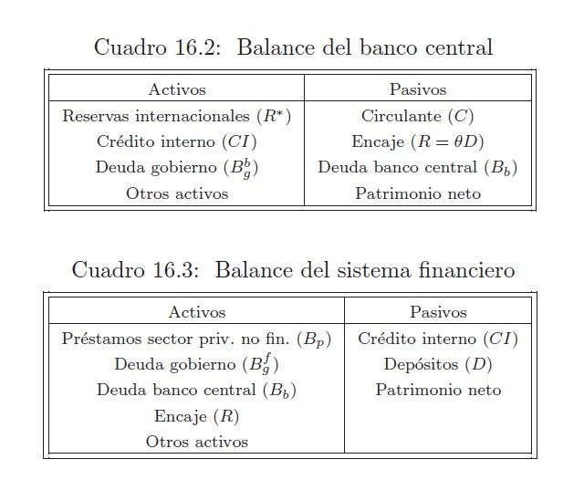

# Referencias

## De Gregorio (2007) Macroeconomía: teoría y política

### Capítulo 15: Teoría cuantitativa, neutralidad y demanda por dinero

### 5.1 La función del dinero

La importancia de este: independiente de su valor actual (por cambios en la inflación), el dinero puede usarse para hacer transacción (función fiduciaria)

**Definición del dinero**
Es un **activo** que cumple con la condición de ser **líquido**. Esta característica lo hace más probable para el uso de sus liquidaciones.

El grado de liquidez nos dará diferentes definiciones de dinero (M1,M2, M3, donde M1 es más líquido que M2 )

Matemáticamente se define como
$$M_1 = C + D_v$$ (1), donde

- *C*: billetes y monedas de libre circulación o **circulante**
- $D_v$: depósitos a la vista, que pueden ser liquidados rápidamente (ejemplo, con un cheques o vales, es decir, dinero que proviene de cuentas corrientes)

$$M_2 = M_1 + D_p$$ (2), donde
- $D_p$: depósitos a plazo

**Funciones del dinero**

**1. Medio de pago**
- Utilizable para transacciones de bienes y servicios
- El formato de transacción puede ser físico o virtual [^1], lo que tiene implicancias en la demanda por dinero.

[^1]: Las tarjetas de crédito **no son** dinero.Si son un medio de intercambio, pero son **deuda** de quién las ocupa, y no un **activo**

2. Unidad de cuenta

- Los precios de los bienes se expresan en términos de dinero.
- Como *unidad de cuenta* **indexada** a los *precios* no es única. En un país [^2] puede tener diversas unidades de cuenta, UF (Unidad de Fomento en Chile), UI (unidad indexada). También con diferentes objetivos (pago de impuestos, arriendos).

[^2]: Estas formas han surgido en países con alta inflación como una forma de protegerse de las fluctuaciones de poder adquisitivo

- Es un *estándar de pagos diferidos*: estipulan pagos futuros

- La moneda es dinero si y solo si es aceptado su uso o por ley (moneda de curso legal) [^2]

3. Depósito de valor

- Medio de ahorro de activos

**El dinero y los gobiernos**
- Emisión de un papel por parte del Banco Central, autoridad que respalda y certifica el dinero.
- Relación 1:1 (oro:dinero), por el respaldo. [^3]. Luego esa necesiad de respaldo ya no era tal pues **el valor del dinero dependía de lo que podía comprar y no del oro que lo respaldaba**.
- Releva la importancia de la certificación que especifique cierto valor y que sea aceptado para hacer transacciones.

[^3]: Convertibilidad en Argentina (2001)

**Tipos de dinero**

1. Dinero mercancía: aquel que tiene un valor en sí mismo
2. Dinero fiduciario: sin valor intrínseco, sino que vale lo que la gente acepta para **transacciones** (más allá de lo normativo o legal)

El **valor del dinero depende de la cantidad de bienes que puede comprar**.  Por eso, en países donde hay inflación, es lo mismo decir "el precio de los bienes sube" o " el precio del dinero baja".

## Capítulo 16: La oferta de dinero, política monetaria e inflación

### 16.1 La oferta de dinero

**1. Liquidez**

El dinero no solo es **medio de pago** (transacciones), sino que está constituido por activos financieros líquidos (transacciones líquidas). Según ello, el $M$ va a variar. En general, hablaremos de

$$M = C + D  \tag{16.1} $$  donde $D$ podría ser $D_v \lor D_p$.

**2. Emisión**

Quién tiene el monopolio de la emisión de dinero, dinero de alto poder o base monetaria ($H$) es el Banco Central.

- En **sistema 100% reservas** *(sistema financiero sin préstamo y deuda)*  lo que el BC ha emitido se encuentra en libre circulación (C) o en forma de depósitos (D). Por lo tanto

$$H = M = C + D \tag{16.2}$$

**3. Encaje**

- Los intermediarios financieros, bancos comerciales, prestan $D$, pero por ley una proporción deben reservarla. Eso es el **encaje**:

$$R = \theta D \tag{16.3}$$ donde $R$ es reserva o **encaje**, $\theta$ es el porcentaje y $D$ depósitos

**El encaje permite:**
  - **Estabilizar la demanda de dinero** y tasas interbancarias
  -  Dar solidez al sistema bancario
  -  No solo es dinero, sino que podrían ser líneas de crédito (p.437)
  -  Gastos operacionales y cumplimiento de ley  (por lo general se debe cumplir en promedio en un periodo)

En caso contrario, se producen problemas de liquidez del sistema bancario y *crisis de pagos*. Ahora bien, evidentemente  el $R$ tiene un *costo de oportunidad* (R se iguala a mínimo legal). Por lo tanto, **considerando el encaje la emisión es**

$$H = C + R \tag{16.4}$$ es decir, la **base monetaria** o **emisión del BC** son reservas de bancos y circulante (billetes y monedas), y no los depósitos.

**Creación de dinero**

Las personas mantienen una razón igual a $\bar{c}$ entre lo circulante y sus depósitos.

$$C = \bar{c} D \tag{16.5}$$

La decisión entre pasar el dinero de C a D o viceversa **depende del costo de transacción**

- El multiplicador monetario es mayor que 1 debido a que $\theta < 1$
- La emisión del banco se ve amplificada por el sistema bancario.

## 16.2 : La política monetaria

- Qué hacen los bancos para afectar la **oferta monetaria**
- El equilibrio del mercado monetario
- Objetivos de los bancos centrales: fijar la tasa de interés interbancarias

**La creación de dinero**

Partir por los análisis de los balances financieros de cada sector económico para consolidar el sistema monetario.

**Banco Central**
 1. Activos [^3]
   - Reservas internacionales: depositadas en moneda extranjera en el exterior
   - Credito interno: a instituciones financieras
   - Deuda: del gobierno, que es un pasivo del gobierno
 2. Pasivos
   - Emisión: circulante ($C$) (activo público), encaje (activo de bancos)
   - Deuda: podría tener pero se consolida con la deuda del gobierno

[^3]: Activo son recursos a disposición, y pasivo, es parte de las obligaciones que va a tener la institución. En macroeconomía un activo es el conjunto de bienes y derechos de una sociedad, es decir, lo que posee más lo que le deben. El activo nos habla de en qué ha invertdo la sociedad, mientras que pasivo sobre el origen de los fondos para realizar las inversiones.

**Sistema financiero**

1. Activos
  - El sistema financiero le presta al sector privado, banco central y al gobierno
  - Reservas de encaje en el banco central
2. Pasivos
  - Le debe al banco central el credito interno
  - Le debe al público los depositos.

**Sector publico y privado**
Activos
- Dinero (M) = D + C
Pasivos
- Deuda del gobiernos
- Deuda del sector privado con los bancos.

Balance

- La base (H) corresponde a los pasivos monetarios del banco central, es decir, excluye deuda y patrimonio neto.
- El dinero (M) son los **pasivos** monetarios del sistema financiero consolidado con el banco central.

####  **Formas de crear dinero base:**
Estas dos formas juegan un rol escencial en analizar los régimenes cambiarios.

**1. Operaciones de cambio**
Si el banco central compra moneda extranjera los cambiará por moneda doméstica (pesos).

A partir del aumento de sus reservas internacionales, se aumentará el **circulante** y con esto se crea dinero.

*Banco Central sin intervención¨*
En sistemas cambiarios de **libre flotación** el Banco Central **no** interviene en el mercado cambiario y por lo tato sus reservas internacionales son constantes y no hay operaciones de cambio.

*Banco Central interviniendo*, cambiando R*
1.1 Régimen de tipo de cambio fijo
1.2 Régimen de flotación sucia
1.3 Intervención esterilizada: operación opuesta para **retirar dinero emitido**

**2. Operaciones de crédito interno**:  corresponde a todas las operaciones que **no** invucran directamente cambio de **reservas internacionales**, a partir de

- Emisión:  "sin tener ninguna otra repercusión" (*helicopter drop*). Lamsam que no tienen ninguna contrapartida.

- **Crédito a los bancos**: para que ellos presten al *sector privado* (firmas). No es muy utilizada pues incolucra decisiones de quién recibe el crédito y en qué condiciones (además el Banco Central asumiría el riesgo del crédito, pasando a actuar como un banco comercial).

Actúa como prestamista directo **en última instancia**. Pero igual con esto los bancos podrían efectuar prestamos **aumentando su activos**

- **Operaciones de mercado abierto**: comprar y vender instrumentos financieros a cambio de dinero. El funcionamiento de estas operaciones **dependerá de las caracteristicas institucionales de la economía**.

*Un ejemplo de emisión con compra de deuda del fisco*

Banco Central **compra deuda del gobierno a bancos** , expandiendose la *base monetaria*. **Sumado a ello** los bancos privados reducirán sus préstamos al gobierno (cae $B_g^f$) aumentando sus colocaciones hacia el sector privado el que aumentaría su stock de dinero a través del proceso multiplicador (*Hacer dibujo*).

Evidentemente ese tipo de financiamiento fiscal no siempre está permitido para el Banco Central, pese a que sea compra de deuda pública en un mercado secundario.

Otro ejemplos para **aumentar la cantidad de dinero** son la compra por parte del Banco Central de:
1. Título de licitaciones
2. Letras hipotecarias
3. Acciones (menos frecuente)

Ejemplos para **redicr la cantidad de dinero** (retirando liquidez)
1. Venta de deuda

### Formas de crear dinero (M1 y M2) *dada* una base monetaria**

1. Variar el encaje exigido: permitiendo que el encaje sea menor, con lo cuál el multiplicador aumentaría, expandiendo la demanda de dinero.
