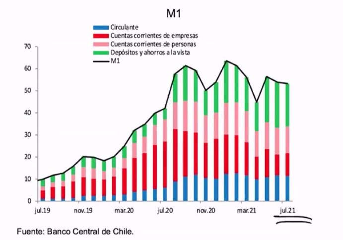

# Macroeconomía II

Profesor: Alexandre Janiak, Caio Machado y Javier Turén.
Formato: [Canal de Youtube](https://www.youtube.com/watch?v=iPXpI_E1pK8)

## Clase 0

La expresión **dicotomía clásica** refiere a esta caracteristicas de estos modelos clásicos de Macroeconomía que dice que la parte real y lo nominal se puede analizar por separado. La macroeconomía clásica dice que la dicotomía clásica no tienen relación lo real y nominal.

Real: desempleo

Nominal: precio, tipo de cambio

Como si ambos conjuntos de agregados fueran independientes. Y la verdad es que al inicio estas variables no estana relacionadas en los modelos. Pensemos en los modelos **precio-costo** marginal. Al final, lo que dice la dicotomía clásica es que si esta se cumple *da lo mismo el aumento de los salarios (en un 1%)* pues esto implicará el *aumento de los precios (en un 1%)*, lo que significa que la relación entre salarios y precios es constante (salarios reales constantes).

Entonces una pregunta evidente es _¿por qué será necesario analizar **la política monetaria**?_

### Banco Central

A partir de *Informe de estabilidad financiera del Banco Central*  se ve un dato que es la tasa del crecimiento del PIB y cómo se construye. Es una **medida de producción**, y la tasa de crecimiento es la variación porcentual respecto de un año a otro.

El Banco Central tiene dos objetivos

1. Estabilidad financiera

2. Mantener los niveles de inflación: niveles bajos de inflación. El umbral que se toma en consideración es que si la inflación, respecto al año anterior, es menor al 3% (entre 0 a 3%), está bien.

En el contexto actual, el Banco Central busca facilitar liquidez al mercado financiero. Se busca seguir dandole existencia, esto es, que la gente este dispuesta prestar (puede desaparecer el crédito por el miedo a la recesión). ¿Qué medidas aplicar es para suavizar esto?

  - Bajar la tasa de interés (tasa de política monetaria). Esta influye en las tasas de interés sobre la economía. Es la plata a la que se prestan los bancos entre sí, las tasas de hipótecas y de consumo. Hay montón de activos financieros está afectada por tasa de política monetaria.
  - El Banco Central podría ayudar al crédito, bajando tasa de interés para aumentar la tasa de crédito

  Pero si se cumple la dicotomía clásica ¿sirve bajar la tasa?

  Llamaremos r la tasa real y pi la inflación, i tasa nominal

- Modelo de Fischer

- Suavizar consumo
- Aumentar consumo
- Mercado financiero

Conversaciones

Postkeynesianos
La tasa de interes nominal es una variable distributiva que afecta al ingreso. Kaleck dice que eso podría afectar a largo plazo y con el cambio en ingreso podría afectar al funcionamiento y rol afectaría la productividad (paper).

Tobin
Masa monetaria aecta a decisiones de portafolio. ¿El dinero y crecimiento?

Balanzas de pago afectan al rendimiento economico - > Prebish

Discusión:
Freeman decía en los 60s : inflación es en todo momento y lugar un momento monetario. Dinero se traspasa a la inflación --> Dicotomoía clásica.

El crecimiento de la tasa del crecimiento del dinero si puede afectar a la tasa de crecimiento.

Poder de negociación los que afectan a la inflación. La tasa de interes nominal --> Banco Central -->autor / inflación

## Clase 0

El largo plazo tiene que ver con cuan flexible puede ser los precios a largo plazo. Los intereses pueden ajustar a los precios como quieran y cuando quieran. En la práctica sabemos que ajustar los precios no es tán fácil.

La pegunta por la flexibilidad de los precios es muy relevante en Macroeconomía II. Esto lo veremos con modelos teóricos, pero hay harta matemática.

Hoy veremos la introducción a ciclos económicos. Uno pude ver de manera clara porque ciertas empresas deja de producir o toman ciertas decisiones. Hay decisiones que son obvias y otras que no.

Se muestra gráfico del PIB ¿qué produjo las recesiones? ¿cuáles son las determinantes de las recesiones anteriores. ¿porqué tenemos esas fluctuaciones economicas?

1. Determinantes de las fluctuaciones económicas
2. Qué se puede hacer en este contexto, los policy makers

3. Algunas de las preguntas relevantes a resolver son: ¿Qué incidencia tiene la política monetaria en las crisis? ¿Qué relación tiene la inflación con la tasa de interés?

Por qué tenemos decisiones, y que se puede hacer en este contexto. Tomaremos las notas de Tom Cunninham de "La palabola de la Macroeconomía"

## Parábola

- Farmers producía todo lo que necesitaba para su familia (producía y consumía, régimen autárquico)
- En general, esto no parece una buena idea. Entonces nos especializamos según habilidades, disponibilidad de recursos, entre otros. Luego, compartimos la producción.
- ¿Como se distribuyen los bienes? Damos dinero para poder intercambiar los bienes.

Las economías modernas hacen esto: nos especializamos e intercambiamos aquellos bienes que no consumimos. Pero, las cosas pueden cambiar. Viene un **invierno** en donde se produce menos zanahorias. Entonces un individuo va al mercado, y decide no gastar todas las conchitas para que en el futuro cuando las cosas estén mal, no disminuyas todas sus conchitas.

La disminución del consumo eso si tiene una restricción, pues no todos pueden estar guardando su salario. Entonces.
- Individuo A gasta 5 conchitas, en vez de 9. Entonces no compra toda la producción de los bienes de B.
- Entonces individuos B no quieren perder producción, entonces disminuyen precios de su producción (¿cuál es el límite?) y así si bien no vuelven con las ganancias ideales, pero volverá con ganancias.
- Ahí hablamos de que los precios se ajustan. Los **precios serán flexibles**, y si hay este **shock** de demanda, no pasará nada con la economía.

Escenario II
- No se pueden cambiar los precios, pues hay regulación.
- Individuos no podrán diversificar su consumo, al corto plazo. Va a existir una reducción del intercambio en la economía.

"When prices cannot change, then a fall in the desire to spend causes a fall in the amount of goofs exchanged, making everyone else worse off"

¿Qué hacemos en esta situación? Los precios no se ajustan y la producción se pierde

## Política Monetaria

Si tu imprimes más dinero, solucionas el problema pues así los consumidores va a tener el dinero que quería y así gasta su dinero, y vuelve con el dinero que quería guardar.

### Política fiscal

Si la gente no quiere gastar, confizcas el dinero en impuestos y la ocupas luego para gastar. Esta es más difícil y cara.

Q: ¿Qué diferencias produce?

Q: ¿Qué lectura corresponde?

## Clase 1

¿Cómo está la macroeconomía en el mundo?

La motivación

1. ¿Cuáles son las causas de las recesiones?
2. ¿Qupe politicas son más afectivas y eficientes para combatir su efecto?
3. ¿Cuál es el rol de la **política monetaria**?
4. ¿Qué tan efectiva es la política monetaria en distintos plazos?

Idealmente finalizando el curso.

1. Entender las distintas razones que explican los ciclos economicos

2. Entender como la autoridad monetaria puede lidiar con estos fenómenos
3. Estamos en un momento muy incierto en términos económicos. Esto hace que estudiar Macro hoy por hoy sea doblemente interesante

El Banco Central puede afectar a la economía, y la política monetaria afecta a corto plazo pues a largo plazo no tiene efecto.

**Contexto internacional**

Existen momentos en los cuales el contexto economico mundial parece reconfigurarse en respuesta a ciertas situaciones **no anticipadas**. El *shok* de algo no anticipado.

La magnitud de como ha evolucionado. La predicción del crecimiento esperado en el 2020, pero en verdad cae.

¿Cuáles son los canales que afectan a la economía? ¿Afecta a la oferta? ¿ O también la demanda?

I. Oferta
1. Cadena de producción se vio cortada. También la de distribución
2. Esto es relevante pues la política púlica debería reaccionar de **manera distinta** si está afectando a un **shok demanda o de oferta**.

II. Demanda
1. Educación y servicios de entretenimiento. El IPOM de septiembre pasado muestra estos.

III. Medidas de constricción

1. Cuarentena
2. Restricciones
3. Cierres de lugares públicos

**Los datos del FMI**

Un hecho importante es que la **crisis** le pega a todos los países mucho, y por igual.

Hay que tener ojo con la base de comparación al igual que pasa con el IMACEC.

Las divergencias **entre países** se deben a factores Como *tasa de vacunación*, *desigualdad*, etc.

La discusión ya no es tanto por gasto público, sino por **tasas de vacunación**

**Análisis por sectores**

- La manufactura cae mucho, la exportación y servicios.

**Chile**
- Los efectos heterogéneos se ven no solo entre los países sino que dentro del los países.
- Es posible que estos efectos heterogeneos se vean en los distintos efectos.
- Pensemos, por ejemplo, en el teletrabajo y como sto afecta a la productividad

**IMACEC en el IPOM**
- El estallido afecta sobre todo a servicios personales (sociales)
- Pero con la pandemia la caída es mucho más fuerte.
- Aquí miramos productividad

**Empleo en IPOM junio 2021**
- Caida muy fuerte en la tasa de ocupados.
- Pero hay heterogeneidad por niveles de calificación, sexo.
- Plomo y naranjo: plomo cae menos pero igual pasa a ser inactivos. Yo: también creo que es informalidad.

A mi parecer se mezcla no solo lo de la calificación sino que automatización.

**Inflación**
- Hay mayor presion por los precios: oferta y Demanda
- Más escacez, más incertidumbre (cobrar un mayor mark up, Pastén con datos de supermercados), la política de gobierno
- ¿Cuál es la razón de presión de precios?
- También pueden ser las ayudas sociales: se genera más liquidez, tasas de hipotecas.

La inflación el Banco Central busca que esté cerca del 3%
- ¿Cómo se hace política monetaria? ¿Por qué se sube la tasa interés? ¿Como afecta a la tasa de cambio?

## Clase 2

1. Introducción a la moneda

¿Por qué existe la moneda (dinero)?

2. ¿Cómo medidos la cantidad de moneda en la economía?

3. ¿Qué determina la oferta de dinero?

Definición: moneda es el stock de activos que pueden ser usados de manera fácil para comprar y vender bienes y servicios.

No es muy precisa pues ¿qué es fácil?

Pero al final del día, dinero es un activo para hacer intercambio.

**Funciones del dinero**

1. Reserva de valor
Con dinero puedes transferir poder compra del presente para el futuro.

Imaginemos que estamos en una villa en donde se produce papas y hay otro que produce zanahorias. Imaginemos que un día queremos consumir menos hoy para consumir más en el futuro. Pero, la papa, es un bien perecible. Entonces hay que encontrar un medio de transferencia del valor de la papa y del dinero.

2. Unidad de cuenta

Podemos medir el valor de las cosas con dinero. En el caso de Chile tenemos el peso y la UF.

3. Medio de intercambio

Esta función, hace 30 años, se decía que era la más importante. El profesor plantea que hoy en día, se ocupan creditos. El crédito es una forma de comprar bienes sin ocupar dinero. La tarjeta de debito si la consideraremos dinero pero no fpisico.

Nosotros ocupamos el dinero para vender y comprar bienes y servicios. Con esto, podemos reducir los costos de transacción.

### 1.2 Tipos de dinero

**1. Dinero fiduciario**: dinero que no tiene valor intrínseco. Solo tiene un valor para comprar cosas.

Otra condición que tiene es **ser emitido por el gobierno**. Entonces, no diremos que el *bitcoin* no es dinero fiduciario.

**2. Dinero mercancía**: por ejemplo, el oro. Sirve para intercambiar cosas, pero tiene otras funciones (anillo, conductor electrónico).

*El bitcoin* ¿cumple las tres funciones del dinero? habría que discutir si cumple valor como reserva de valor.

*El salitre* dejó de tener un valor intrínseco, pero (aunque no es el caso) podría seguir teniendo valor de transacción.

El dinero **fiduciario** requiere algún grado de **coordinación** entre los agentes. Yo solo trabajo y acepto un papel como intercambio, pues pienso que el día de mañana voy al mercado de bienes y esto me sirve para comprar algo.

Es importante que las **expectativas** de los agentes esté alineada. Hay buena parte de la literatura monetaria del *porqué aceptamos dinero*.

### Historia del Dinero

Al inicio se utilizaba el dinero mercancía (oro). Pero empezó a ocurrir que el dinero mercancía era difícil de "medir" (oro de buena calidad). Esto aumentaba los costos de transacción. Entonces el **gobierno** empezó a **verificar el dinero mercancía**.

En este segundo periodo, el oro era certificado por el gobierno. En un momento, el dinero empezó a dar certificados de oro. Esto ayudó mucho pues sirvió para transportar de manera más fácil las transacciones, pues habían *lastres* de otro. Entonces se podía cambiar el certificado de oro por oro.

En un momento, se dijo que ya no se necesitaba ese lastre. Entonces, los dolares se daban sin lastre de oro.

Hay una visión moderna de porqué valoramos dinero fiduciario

*"A prince", who should enact that a certain proporion of his taxes be pais in a paper money of certain kind, might terebygive a certain value yo this paper money" (Smith, Wealth of Nations, Vol. I, Book II, Chapter II).*

Al final, el dinero fiduciario tiene valor pues podemos pagar impuestos con dineros.

- *"Fiscal theory of the price level"*. Esta teoría plantea que el dinero ya no tiene tanto valor como medio de intercambio. Es una unidad de cuenta para pagar impuestos. (Q: ¿Dónde leer?). El dinero fiduciario en verdad tendría "lastre" en el derecho de pagar impuestos. Al menos el profesor así lo plantea.

(Q: ¿qué pasa con los concursos públicos donde se debe dar vale vista?) --> prestamo, es como colateral.

El dinero, funciona como colateral, para prestámos. Otra función de los activos líquidos.

El valor de los dineros es el dinero + el surplus. El valor del bono es lo que se puede pagar en los bonos.  Los bonos tienen un valor más allá de lo que valen los bonos.

Esto es importante de considerar sobre todo en economías donde han empezado a dejar de ocupar el dinero como medio de intercambio.

### 1.3 Agregados monetarios

¿Cómo se cuanto dinero hay en la economía?

1. Oferta de dinero: cantidad de dinero en la economía. El dinero es distinto a billetes. Hay otros activos que nos permiten hacer la compra de bienes y activos.

2. Liquidez de un activo: es cuán fácil es utilizarlo para comprar o vender bienes y servicios.

**Un activo** es clasificado como dinero si **es muy líquido**. Voy a establecer un umbral definido por $L^{*}$. Y la definición del umbral de $L^{*}$.

**Definiciones de la cantidad de dinero en la economía**

Definiremos dos activos que consideramos dinero.

- $M_1$: cantidad de dinero **circulante**. El valor de todo lo que está en "bolsillo" (corriente, de débito) y "depósitos a la vista".

$M_1 = C + D_v$, Donde

$M_1$: agregado monetario
$C$: dinero circulante
$D_v$: depósitos a la vista

- $M_2$: incluye a $M_1$ además de los depósitos a plazo. Esta definición es más amplia. Esto es bien líquido, pues lo cambio y puedo cambiar bienes.

$M_{2} = M_{1} + D_{p}$ o reemplazando

$M_{2} = C + D_{v} + D_{p}$

### 1. 4 Bancos y moneda

- Ejercicios
- Modelos

## Clase 2: Dinero y multiplicador monetario

La creación de dinero viene del Banco Central pero también hay una creación de dinero secundaria por parte de bancos comerciales.

**Función del dinero**

La diferencia del dinero con otros activos es su liquidez, por lo que es fácil de transar.

1. Medio de pago
2. Unidad de cuenta: sirve para contar cosas.
- La UF está indexada a la inflación, pues corrige por el poder adquisitivo.
3. Depósito de valor: también sirve para acumular activos, lo que permite trasladar dinero para suavizar el consumo.

El dinero es fiduciario, es decir, no tiene un valor intrínseco si no que el de transferencia. No solo es introducir una moneda (bitcoins), sino que sean aceptada.

**Cantidad de dinero** u **Oferta de dinero**

La oferta del dinero, se define como
$$M_1 = C + D_v$$

- $C$: circulante
- $D_v$:

El $M_1$ es altamente líquida. Mientras que el $M_2$ será menos líquido.

$$M_2 = M_1 + D_p$$

Enn marzo 2020 fue fijar el mínimo técnico en 0.5% (no puede ser 0, para poder generar algún grado del sistema financiero). Ese valor se tuvo hasta julio 2021 (0.75%). Bajando tanto la tasa aumenta el $C$ (circulante).

La tasa que fija el Banco Central (TPM) 0.5%, que define la tasa de flujo entre Bancos Privados y Banco Central. Te presto TPM + 25 puntos bases. Entonces se presta a 0.75%.

**Objetivos del Banco Central**

1. Mantener los estables, control inflación
2. Mantener estabilidad del sistema bancario
  - Tasa interbancaria: tasa entre que los bancos se prestan.
3. ¿Desempleo? pues tiene efecto la política monetaria al corto plazo.

Mientras más alta la TPM, se frena la inflación pues se es más cautos, se presentan menos creditos pues si hay que devolver la plata desde bancos privados y no tienen plata, será más dificil devolver la plata. Entonces el BC sube el TPM y se es más cauto en prestar plata, se financian menos cosas (inversión).

**Oferta de Dinero** (M)

- M no es lo mismo que H (la base monetaria)
- El Banco Central afecta la oferta de dinero, sino que la emisión de dinero.
- El H (emisión) el BC tiene su monopolio.

**Multiplicador monetario**

El multiplicador monetario podrá cuantificar la cantidad máxima. Nace como una implicancia del sistema de reservas.
Mide la máxima cantidad de dinero en una economías

El multiplicador nace como una implicancia de los sistemas de reserva impuestos a bancos privados.
  - Los bancos están obligados a mantener un % de sus depósitos como Reservas
  - A esto se le conoce como "encaje legal"

Ese dinero no siempre está en la reserva, por el costo de oportunidad de tenerlo aí. Sino que se reinvierte.

Encaje legal: basilea III. ¿cuál es el porcentaje de encaje legal?

**Reservas** (R)

Estudiaremos el rol de las reservas en el **proceso de creación** secunaria de dinero.

Lo que hace la ley al final del día lo que hace es que las reservas sean iguales o mayor a los depósitos totales del banco.

Imáginemos que el encaje es de 20%, la reserva no será 30%.

**Base monetaria** (H)
Se refiere a la *emisión de dinero*. El BC emite dinero, circula, y ese circulante es depositado por las personas. Y ese depositado es prestado por las personas.

BC --> hace H --> bancos privados (min 16.16)

Un porcentaje de la emisión está en las personas y la otra está en personas.

La base monetaria será circulantes más reservas.

Ahora supongamos que la gente tiene preferencias por C sobre D. Una parte me lo llevo al bolsillo y otra la deposito.

- El BC inyecta 100, y los bancos privados lo reinvierten y los encajes son pocos. Entonces el dinero en la economía circulante es mayor (**solo por el giro del banco de prestar plata**). Por eso se ve que el multiplicador es positivo.

Prueba:
La relación entre el dinero y la emisión, es el multiiplicador monetario (mm).

La cantidad de emisión del banco central es mayor.

---

Dibujo: si sumo las cosas que voy dando vueltas de p1, p2, p3, llegaré al multiplicador. Eso se genera por prestar plata que no tienen.

  - Con eso hblaremos de tasa interbancarias
  - Oferta monetaria.

## Clase 3

### Oferta de dinero

El **banco es como una guadería de dinero**, con esto el banco acredita tu dinero en la cuenta,

#### Fractional reserve banking

- Suponga  que para todo peso depositado en los Bancos

  - Una fraccion $\theta$ pertenece (0,1) es almacenado como reservas
  - Una fracción $1-\theta$ es prestada para Bob

- Por ahora para simplificar: Bob no deposita dinero en el bancos
- Suponga que el banco central imprimir X pesos y lo transfiere a John

- John deposita todo que recibe en el banco
- Pregunta: ¿cuánto ha cambiado la oferta de dinero?

El banco al hacer prestamos, termina por crer dinero en la economía. No siempre esto tiene un lastre en la economía.

Por eso no solo el **banco central** afecta la oferta de dinero en la economía, sino que también los **bancos comerciales**.

**Escenario 2**
Ahoea suponga otro Escenario
 - Bob tambien depsita el dinero que recibe como prestamos en algun bancos
 - que a su vez presta una fraccion 1- $\theta$ de los depósitos recibidos a Ana
 - que a su vez deposuta todo en el banco que presta a Amanda

 ¿Cuanto cambia la oferta de dinero cuando el banco central imprime X pesos y lo transfiere a John?

**M depende**
- Cantidad que el banco central imprime
- Del comportamiento de los bancos (prestamos vs acumular reservas)
- Cuanto las personas usan sus cuentas de deposito

Si...c comportamiento de las personas

- $c$: C/D > 0

## Clase 3

H es una variable endógena para el Banco Central. El proceso de prestar dinero desde los bancos produce dinero.

Si $\theta$ = 1, tendría que guardar todo, y no habría creación secundaria del dinero. La Basilea es quén regula el $\theta$, que es del mercado de capitales.

Si los bancos creen que hay riesgo de corridas bancarias - "corralitos", por la incertidumbre económica hay momentos en donde la gente deja de creer en el sistema financiero, y van a sacar su plata (por expectativas, Nash). Eso podría incentivar a los bancos comerciales podrían aumentar su $\theta$.

Dado que el banco está prestando menos, el dinero circulando será menor, entonces el multiplicador será menor

### Balance Banco Central

- Reservas internacionales: monedas, que sirven para mantener la estabilidad del sistema financiero, principalmente del **tipo de cambio** (eStán en moneda extranjera y no nacional).

Sirven de estabilidad del tipo de cambio puede afectar la inflación doméstica. La eslaticidad del past true

- Crédito interno: bancos privados o instituciones financieras. Esto pasa a ser un activo del Banco Central y pasivos para bancos privados. La TPM tiene que ver con esta partida del crédito interno ( la tasa que presta el dinero)
- Deuda pública

Pasivos
- El circulante es pasivo pues el Banco Central tienen que hacer respaldo del dinero. Y eso mantiene la estabilidad de la economía.
- Reservas: $R=\theta D$ el encaje legal es un pasivo, pues se los debe a los bancos. Y luego será un activo para el sistema financieras.

En la práctica **¿Cómo el BC crea dinero?**

Existen distintos mecanismos para crear dinero.

1. Operaciones de crédito interno
* Mercado abierto:
* Creditos a bancos a privado

**Operaciones de mercado abierto**
Compra de instrumentos financieros. Por ejemplo, bonos por dineros.

Supongamos que BC quiere aumentar el H. Lo que hará la TGR (Tesorería General de la República) es emitir un bono. Ese bono se paga con plazo. Y cuando se paga ese bono, la TGR, lo paga.

Se hace con un papel, y con eso inyecta plata a la TGR.

**¿Autonomía del Banco Central?**

- ¿ Qué pasa con las operaciones de mercado abierto?
- ¿Cómo hacer política monetaria si se pierde la autonomía? Se puede hacer que esta comproa-venta ya no sea por bonos, a partir de *prendas* (dejar algo en parte de pago).

$Qi$: con bonos a largo plazo, puede aumentar la tasa de rendimiento.

TPM: es a dos años.

IPOM: a dos años plazos.

## Clase 4

**Operaciones de mercado abierto**

El banco central  aumenta el $B_g^b$, así aumenta H y también M.

Esta operación en banco central y sector públicos.

**Operaciones a Bancos Privados**
- Si el Banco  Central quisiera aumentar H, puede hacerlo aumentado la linea de crédito a bancos privados.
- En otras palabras, auemta la base monetaria aumentando prestamos  al sistema financiero.
- Dado que la decisión proviene del Central es ésta institución quién asume **la myor parte** del riesgo de dicho préstamos.
- Este tipo de operaciones son importantes sobretodo en tiempos de **estrés** financiero. Esto tiene que ver con el nivel de reserva de depósitos (un banco que esté muy cerca del límite, entonces se ven las hojas de balances)

Mantener la estabilidad del sistema financiero es objetivo del Banco Central (junto con la **estabilidad** del (1) nivel de precios y el (2) sistema financiero)

Los bancos aceptan el crédito no solo porque el Banco Central asume deuda, sino que la tasa es más baja.

#### Política Monetaria en la práctica

- Como saben la Política Monetaria se basa en la fijación de la tasa de política monetaria (TPM). Esto ocurre pues dado que el banco central mueve la oferta

- Mirando las hojas de balance, comentamos que la TPM determina la tasa apromedio a la que los bancos y otras instituciones financieras se prestan fondos entre ellos *overnight*)

- Veamos ¿cómo esta tasa incide en la economía **en la práctica**?

**Implementación de la política monetaria**

El BCCh ejecutiva su política monetaria influyendo en la tasa interés interbancaria *overnight*. Esta corresponde a la tasa a la cual los banco se otorgan créditos entre sí, de un día a otro. Como cuaquier otro mercado, el precio (en este caso, la tasa de interés interbancaria)

El **corredor** de la tasa de la política moentaria, hay dos mecanismos. Para regular a diario la liquidez existen dos mecanismos principales FPL y FPD.

Tasa política monetaria a 25 puntos bases.

Los bancos privados deciden guardar plata en el BC, ganando un poco de interés.

Entonces son dos tasas: hay 25 puntos bases arriba y 25 puntos bases hacia abajo. La gran mayoría de los bancos centrales funcionan así. La diferecia está cuando se define estar sobre el 0 (on the floor).

Tasa politca monetaria es la que fija el BC. El BC ofrece + 25 por sacar y -25 por guardar. La overnight (interbancaria) es controlada por ese 25bp, pues no se moverásobre ese corredor pues si no saldria mas caro pedir credito o muy caro guardar.

Si se sube TPM, va a subir el costo de la liquidez. Entonces los bancos va a implicar que los bancos serán más cuidadoso de prestar plata. Entonces con eso se puede *regular la inflación*.

La política monetaria es corta, se mira a corto plazo.

Tasa de política monetaria en USA
- Discount rate: tasa a la que presta.
- Reserves rate (overnight repos)
- Interbank rate

*El corredor de la política monetaria*

Zero lower bound.

- La tasa, como cualquier precio, se determina por el equilibrio entre oferta y DemandaDado una demanda por reservas (requerimientos de liquidez y depósitos por parte de bancos), el Banco Central altera H (oferta).

### **2. Operaciones de cambio**

El Banco Central podría aumentar H alterando su nivel de reservas de R*.

- Se compará moneda extranjera, y la inyecto a la economía.

- Hay que tener cuidado pues el *tipo de cambio* (TC) es flexible, el banco central no altera R* y exita hacer operaciones de cambio.

- De hecho, aumentar el M tare un efecto en la tasa de interés lo que finalmente afectará al TC (lo estudiaremos más adelante).

Ahora, el Banco Central podría alterar R* sin modifcar H. Recoremos que el BC busca también dar estabilidad del sistema financiero.

- Operación esterilizada

Entonces, las reservas sirven como

¿Cómo podrían cambiar las reservas internacionales el BC sin modificar H?
- Intervención esterlizada
- En el caso que aumente R, puede ser contrarrestado con  **contracredito interno**
- Repactar la deuda nacional con moneda internacional, y esa moneda internacional la guardo y no la dejo dentro de la economía.

**3. Modificación del encaje legal $\theta$**

Si bien en las reuniones de Basilea se define el $\theta$, producirá cambios en M. Lo común es que los bancos mantengan lo mínimo legal, pero a veces se cambia el teta aumentando para evitar corridas bancarias.

Preguntas:

## Clase 5: Demanda por dinero

Miramos desde el Banco Central todo lo que tiene que ver con la oferta de dinero. Pero, como todo en economía, si hay oferta hay demanda. La demanda por dinero es un poco más abstracta. Las preguntas claves son ¿por qué la gente quiere dinero? ¿cuál es el precio del dinero?

**Demanda por dinero en equilibrio parcial**
Dos teorías ocuparemos sobre la gente que demanda dinero
1. Modelo Baumol - Tobin (BT)
  - Modelos estáticos
2. Modelo "Cash in Advance" (CIA)
  - Modelos dinámicos

### Modelo Baumol - Tobin

- Preguntas: ¿ cuáles son los determinantes de la demanda por dinero? El modelo B-T intenta entender la demanda por dinero enfocando en la función del dinero como medio de intercambio.

**Supuestos claves**
- Dinero es necesario para comprar/vender bienes
- Usar dinero tiene un costo de oportunidad
- El dinero es demandando por la gente para realizar transacciones, y va al banco a hacer las transacciones.

**La lógica**
- Los agentes necesitan Y pesos para gastar (hacer intercambios) en un años

  - El gasto es uniforme: Un agente gasta Y x dt en cada intervalo de duración dt.
  - Podemos pensar en Y como un ingreso total de un agente.

- Los intercambios se realizan solamente con circulante (en efectivo)
  -  Para simplificar, supone,os que los depósitos en el banco no son dinero por ahora, como si fueran muy poco líquidos (ver ejercicio 2.1 en el Workbook para relajar este supuesto)

- Todavía, agentes necesitan ir al banco para hacer retiros de efectivo. Estos retiros serán costosos.

**Opciones de los agentes**

1. Opción (1): gastar i pesos, que lo voy gastando a lo largo del años. Se va una vez al banco y se retira "i" de pesos.

2. Opción (2): ir dos veces al banco, y retirar y/2 cada vez que voy al banco. ¿Cuanto es la tenencia promedio de este agente?

n. Opción (**n**)
Ir n veces al banco y retirar y/n cada vez

**Qué va a elegir óptimamente los agentes**

- Costo de oportunidad de usar dinero = *i* (tasa de interés)
- Z  = costo (exógeno) de ir banco hacer retiros
- Los agentes minimizan:
  -

- Individuos reciben ingreso Y (exógeno), en su cuenta de ahorro (no cuenta corriente, sino una que tiene algo de interés)

- Dicho dinero debe ser gastado completamente en un lapso de tiempo (ejemplo: un mes o un año). No puedo ahorrar al siguiente mes.

- El dinero ahorrado reciben intereses iguales a $i$. Ahora asumiremos la existencia de una tasa de interés.

- Z: Costo fijo de trasladar fondos de su cuenta de ahorro a la cuenta corriente (efectivo). Antiguamente hablabamos de ir el costo de ir al banco (en tiempo), hoy eso es más raro.
  - Suponga que Z como costos asociados a la transacción (rescate) o costos asociados
  - Podemos pensar en la prima que te exigen cuando quieres sacar esa plata de fondos mutuos y llevarla a tu cuenta corriente.

- Sea n el número de retiros realizados por el inidivudo en una unidad de tiempo.
- Asumiendo que cada retiro es de magnitud R (es decir, siempre gasta/retira lo mismo):

$$nR = Y \Longrightarrow \frac{Y}{n} = n$$

- El "trade off" de no llegar y sacar todo es el *interés* (si lo saco, dejo de ganar la tasa de interés asociado a tener ese ahorro).

En el dibujo de la clase:

- $\frac{R}{2}$ nos indica el retiro promedio que es informativo porque
  - Y $R = \frac{y}{n}$, el dinero promedio será $\frac{y}{2n}$

Dada la linealidad impuesta en la demanda ¿cuánto es la demanda promedio de dinero **por unidad de tiempo**?
  - Punto medio entre demanda máxima

- ¿Cuáles son los costos?

1. Costo de oportunidad: dinero promedui que dejo de recibir por realizar n retiros durante el mes
2. Costo de retiro: cada retiro tiene asociado un costo Z

minimizaremos $C (n) = (\frac{y}{2n}i + zn)$

Elegiremos el *n* óptimo (o R óptimo, pues el y es exógeno).

La demanda por dinero está dada por $ud^d = (\frac{yz}{2i})$. De ello podemos decir

- El precio del dinero es $i$, que tiene que ver con el costo de oportunidad. Lo cuál tiene sentido pues la demanda por dinero será negativa cuando el interés aumentar
- La relación será positiva con ingreso, pues entre mayor este más posibilidad de demandar dinero tendré
- Si el costo es muy grande (Z) será racional sacar más dinero.

Si el Banco Central ya mira la oferta del dinero $u^o$. Las familias y empresas se preocuparán por la $u^d$.

La presencia de una tasa de interés hace que no sea óptimo rescatar completamente los fondos. **Precio del dinero es la tasa de interés**.

**Elasticidades**

Aplicando el logaritmo (ln) a la Demanda (linealizar)

$$ud^d = \frac{yz}{2i}^\frac{1}{2}$$

Podemos calcular la derivada parcial del ingreso y con ello vamos a tener la **elasticidad** de la demanda del dinero con respecto al ingreso.

$$ \frac{\partial ln u^d}{\partial ln y} = \frac{1}{2}$$

También la elasticidad en relación a la tasa de interés (o precio del dinero)

$$ \frac{\partial ln u^d}{\partial ln i} = - \frac{1}{2}$$

Como podemos ver es **negativo**. Si aumento mi ingreso es muy costoso mantenerlo en el bolsillo, si la tasa de interés aumenta. Por ello, si sube el interés, mi demanda por dinero va a disminuir cuando mis ingresos aumentan.

Ahora puedo ver en la realidad si estas proyecciones del modelo se cumplen (si se acerca al 0,5 o -0,5). Si no es así, es probable que al modelo le falta. En econometría diríamos que estos modelos son testeables.

En los datos debemos comprobar si estas elasticidades se cumplen.

Ejemplo:

- Si mi ingreso sube 10%, mi demanda por dinero sube 5%. No sube 1 a 1 pues esta igual, no solo depende de subir mis ingresos sino que también de n. Esto pues en la medida en que subo mis ingresos también voy a hacer más retiros (pues mi ingreso será más grande)

- Si la tasa de interés aumenta en 10%, mi demanda por dinero disminuye 5%. Pero se debbe considerar *la base* si digo 10%  y estaba en 1% es que subió a 11%.

**Ilusión monetaria**

- Primero, pensamos en el dinero pero relativo a lo real. Cuanto me alcanza comprar con mis ingresos. "El saber cuánto vale lo que se gana".

Puedo volver a escribir la demanda de dinero, pero ahora considerando el ingreso real.

Ilusión monetaria es creer que lo nominal es lo real. El modelo no sufre ilusión monetaria, pues si las cosas son 3% más caras, yo demandaré 3% más de dinero. No siempre pasa eso en economía (los modelos sufren de eso) y también las personas en psicología.

## Clase 6

A partir de lo que hace el Banco Central, subir, 0,75 puntos bases.
1. Rol del Banco Central
2. Tiempos de la política monetaria

Estamos en un momento donde la inflación está en alza.
- La incertidumbre hace que la economía se frene: los precios tienden a subir (subiendo los markups) y la contratación y empleo la incertidumbre frena las inversiones (veamos qué pasa y hagamos cosas).
- Hay presión de la demanda agregada y oferta agregada. No tiene que ver solo con la demanda. Pensemos, por ejemplo, la oferta de empleo por ejemplo sigue sin recuperarse completamente (inactividad y ocupación informal). Ellos no se ven corregidos sus salarios por la inflación.

**IPOM** (página 43)

- Lo contracícilico y cíclico: movimiento de la demanda y oferta si se dan en la misma dirección o no.

- El consejo subió TPM hasta 1,5% en agosto (+75 pb), tras haberla incremetado en 25 pb en julio, y anticiá continuará retrando retirando el impulso monetario para llevar la TPM a niveles en torno a su valor neural hacia mediados del primer semestre del 2022.

**Corredor de TPM**, en la EEE se pensaba que sería menos. Los insumos son diferentes encuestas y proyecciones de escenarios (incluso con COVID).

**Inflación le esta afectado a los quintiles más bajos:** lo que sube su precio son los bienes de primera necesidad.

Hay trade-offs, tiene que decidir. No puede generar aumento sobre salarios, sin producir efectos en el desempleo.

### Modelo in Cash in Advance

La política monetaria es neutral en el largo plazo, nos sirve para salir del ciclo económico y no para el crecimiento general de, país.

Recursión de Bellman: un punto fijo donde se vacía la oferta y demanda (t y t+1).

**Preliminares**

- Agente homogéneo (hogar)
- El bien se utiliza tanto para consumo (C) como capital (k)- Función de producción neo-clásica y no hay incertidumbre.

El consumidor define sus trayectorias
1. Consumo en cada perdiodo
2. Inversion en capital en cada periodo
3. Tenencia de bonos
4. Demanda por dinero

**El problema del consumidor representativo**

**Restricción presupuestaria**
- Veamos las cuatro decisiones que tengo: consumir hoy por un bien, inventir por un bien, invertir en bonos y cuánto yo necesito de dinero para consumir. Estos son los gastos.

- La riqueza asociada es similar considerando el pasado.
